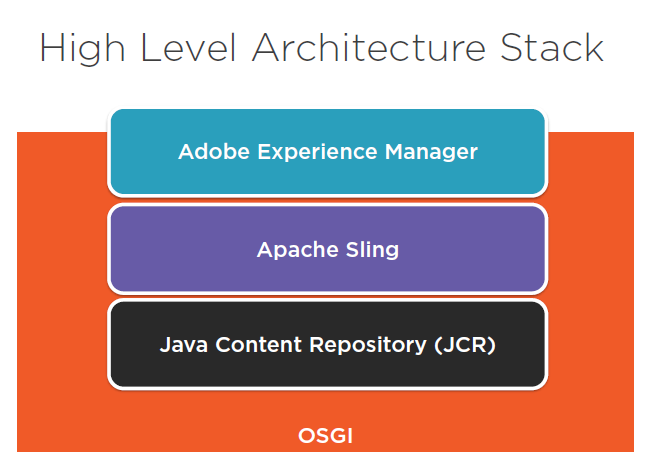

# Architecture

AEM 基于 Granite 构建，同时融入了 Sling 和 JCR 技术。

## What Is Adobe Experience Manager

- Enterprise Web Content Management System
- Framework for building websites, mobile apps,
  forms and more
- Includes content, asset, mobile app, community and form
  management features
- Integrated solution within the Adobe Marketing Cloud

## Key Principals

### Favor modularization and componentization

- OSGi Services modularize backend
- Web pages in AEM are composed of multiple components code and dependencies

### Hierarchical and unstructured by default

- AEM Repository is a tree of content
- Composed of Nodes and Properties
- Some structures:
  - Pages
  - Folders
  - Files
  - Configurations
- Default is unstructured
- **Everything is content!**

### Multi-tier architecture

### Focus on content and authors

- AEM is designed to rapidly develop and manage content
- Author experiences should make it easy to create great content

## Technological

- Granite 包含很多基础模块，比如 Granite UI 等。

### OSGi framework

OSGi framework 是一种 Bundle 技术标准，AEM 的实现采用了 Apache Felix 项目。它是 Application Runtime。

### JCR(Java Content Reporsitory)

JCR 是一种内容数据库标准，用于存储数据，AEM 的实现采用了 Apache Jackrabbit Oak 项目,在 AEM 里叫 CRX Content Repository。类似于.net 项目中的使用的 SQL Server。它是 Content Reporsitory。

### Apache Sling

Apache Sling 用于处理 REST 请求。类似于.net 项目中的 MVC 框架，将请求的 URL 映射为 JCR 中的 node(也就是 Resource)。它是一种 Web Application Framework
