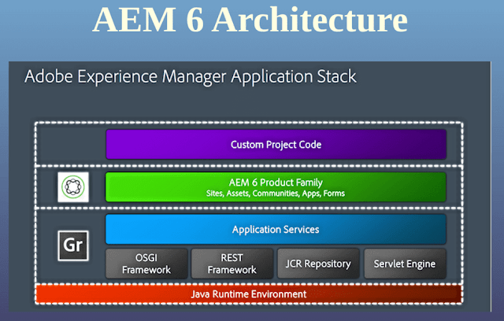

# Architecture

AEM 基于 Granite 构建，同时融入了 Sling 和 JCR 技术。

Granite 包含很多基础模块，比如 Granite UI 等。

- Sling 是一种 Web Application Framework，用于处理 REST 请求。类似于.net 项目中的 MVC 框架，将请求的 URL 映射为 JCR 中的 node(也就是 Resource)。

- JCR 是一种内容数据库标准，用于存储数据，AEM 的实现采用了 Apache Jackrabbit Oak 项目，在 AEM 里叫 CRX Content Repository。类似于.net 项目中的使用的 SQL Server。

- OSGi 是一种 Bundle 技术，AEM 的实现采用了 Apache Felix 项目。
