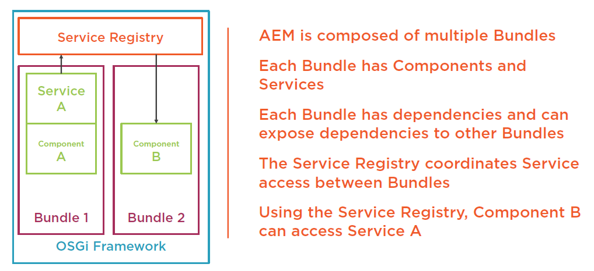

# OSGi

## What Is OSGi

- Technology specification for a Dynamic Component System
- Composes applications from reusable Components
- Components hide their implementation details by default
- Components communicate via Services Apache Felix is the OSGi implementation for AEM

## OSGi Terminology

- Bundle – Collection of components, similar to a JAR
- Component – Unit of functionality, similar to a Java Class
- Service – Interface for communicating between Components and Bundles
- Service Registry – Manages the services and bundles inside OSGi

## How Does It Work



## OSGi Annotations(Deprecated)

```java
@Component(immediate = true)
@Service(ServiceInterface.class)
@Properties({ @Property(name =Constants.SERVICE_VENDOR, value = "Company") })
public class ServiceImpl extends ServiceInterface {
    @Reference
    private AnotherService anotherService;

    @Override
    protected Result doStuff() throws Exception
    {
        // ...
    }
}
```

- @Component - Define an OSGi Component
- @Service – Define an OSGi Service
- @Property – Define a meta property for an OSGi Component/Service
- @Reference – Retrieve an OSGi Service

## OSGi Resources

[OSGi Specification](https://www.osgi.org/developer/specifications/)
[Apache Felix](http://felix.apache.org/)
[AEM OSGi Web Console](http://localhost:4502/system/console)

OSGi 是基于 Component 编程的。Component 可以暴露为 Service 给外部使用。常见的 Service 包括 Servelt/Scheduler/Filter/EventHandler 等。同时，AEM 的 admin 可以在后台配置 Service 的参数。

```java
// 以提供一个Runnable Service为例
// 1. 定义Service接口API，这里是Runnable
// 2. 实现接口API


@Designate(ocd=SimpleScheduledTask.Config.class) // 3. 使用 admin 配置接口
@Component(service=Runnable.class, immediate=true) // 1. 将 Java 类定义为 OSGi 的 Component，并将该 Component 注册为 Runnable Service。如果将 service=Runnable.class 删除，Service 会自动注册为 Runnable Service，也就是说，会默认注册所有实现的接口的 Service。通常来说最好显示定义 Service。如果不需要注册 Service，写为 service = {}。, immediate=true 表示在启动Component的同时立即启动Service。
public class SimpleScheduledTask implements Runnable {

    // 2. 创建 admin 配置接口。这是一种 Metatype Generation，不用重启服务器就能获取最新的配置。
    @ObjectClassDefinition(name="A scheduled task",
                           description = "Simple demo for cron-job like task with properties")
    public static @interface Config {

        @AttributeDefinition(name = "Cron-job expression")
        String scheduler_expression() default "*/30 * * * * ?";

        @AttributeDefinition(name = "Concurrent task",
                             description = "Whether or not to schedule this task concurrently")
        boolean scheduler_concurrent() default false;

        @AttributeDefinition(name = "A parameter",
                             description = "Can be configured in /system/console/configMgr")
        String myParameter() default "";
    }

    private final Logger logger = LoggerFactory.getLogger(getClass());

    private String myParameter;

    // 5. 重写 run()，SimpleScheduledTask 执行时执行
    @Override
    public void run() {
        logger.debug("SimpleScheduledTask is now running, myParameter='{}'", myParameter);
    }

    // 4. 当 Component 激活时，调用该方法
    @Activate
    protected void activate(final Config config) {
        myParameter = config.myParameter();
    }

}
```

[console-components](http://localhost:4502/system/console/components/) 和 [console-services](http://localhost:4502/system/console/services/) 中可以查看是否生效。

AEM6.2 之后，推荐使用 `org.osgi.service.component.annotations.*` 和 `org.osgi.service.metatype.annotations.*` 来替代之前的 `org.apache.felix.scr.annotations.*`。

[参考 1](http://www.nateyolles.com/blog/2017/05/osgi-declarative-services-annotations-in-aem)

[参考 2](https://github.com/nateyolles/aem-osgi-annotation-demo)

[part I](https://blog.osoco.de/2015/08/osgi-components-simply-simple-part-i/)

[part II](https://blog.osoco.de/2015/08/osgi-components-simply-simple-part-ii/)

[part III](https://blog.osoco.de/2015/11/osgi-components-simply-simple-part-iii/)

OSGi 有一个 SCR(Service Component Runtime) 来管理所有 Component。`@Component`在编译阶段编译，然后在 target 中生成 xml 文件描述这个 Component，类似于 Spring 的机制。部署到 AEM 后，SCR 负责 Component 的运行及依赖。`@Reference`用于定义该 Component 以来的其他 Service。`@Active`和`@Deactive`是 SCR 接管后，Component 的生命周期函数。只有该 Component 的所有 Reference 都正确 Inject 进来后，才会执行`@Activate`。同时，SCR 会管理 Component 需要的配置。
