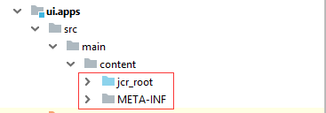

# AEM Package Structure



ZIP file with two folders jcr_root and META-INF

- jcr_root contains **AEM content**
- META-INF contains filter and **package configurations**

## AEM Content Within a Package

- Similar structure to AEM Repository

  - Structure set with folders and files
  - Nodes extending nt:hierarchyNode stored as folders
  - Sub-node structure stored in .content.xml files
  - Files stored directly

- Only contains filtered content

### .content.xml File Structure

```xml
<?xml version="1.0" encoding="UTF-8"?>
<jcr:root xmlns:sling="http://sling.apache.org/jcr/sling/1.0" xmlns:cq="http://www.day.com/jcr/cq/1.0" xmlns:jcr="http://www.jcp.org/jcr/1.0"
    jcr:primaryType="cq:Component"
    jcr:title="Breadcrumb"
    demovalue="{Long}382"
    demoarray="[value1,value2,value3]"
    sling:resourceSuperType="core/wcm/components/breadcrumb/v2/breadcrumb"
    componentGroup="Demo Project Components"/>
```

- jcr:root acts as a container
- JCR Namespaces represented as XML Namespaces
- Nodes stored as XML elements

  - Node properties stored as attributes
  - Value type indicated in brackets: `demovalue="{Long}382"`
  - Arrays stored comma-separated: `demoarray="[value1,value2,value3]"`

## Package Configuration

Primary Configuration Files:

- filter.xml  
   Configures what content should be included in the Package.
- properties.xml  
   Configures package name, ID, version and path

### filter.xml

Each filter is an entry with:

- Root path: only content under this path
  will be evaluated for the filter
- Exclude rules (optional): content
  matching these will be excluded
- Include rules (optional): content
  matching these will be included
- Order is important, first rule defines
  behavior

```xml
<?xml version="1.0" encoding="UTF-8"?>
<workspaceFilter version="1.0">
    <filter root="/conf/demoproject" mode="merge"/>
    <filter root="/content/demoproject" mode="merge"/>
    <filter root="/content/dam/demoproject" mode="merge"/>
</workspaceFilter>
```

Filters represented as a `<filter>` element

Includes and excludes as child elements

Mode allows for configuring update option:

- replace – default behavior, overwrite
- merge – add new, don’t delete / modify
- update - add and modify, don’t delete

## Common Package Operations

- Edit
- Build
- Install / Reinstall
- Download
- Replicate
