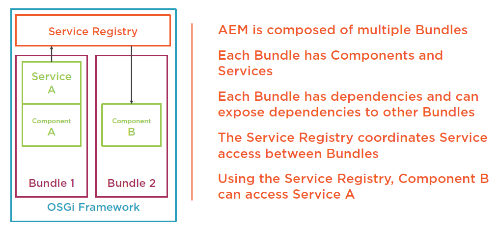

# OSGi

## What Is OSGi

- Technology specification for a Dynamic Component System
- Composes applications from reusable Components
- Components hide their implementation details by default
- Components communicate via Services Apache Felix is the OSGi implementation for AEM

## OSGi Terminology

- Bundle – Collection of components, similar to a JAR
- Component – Unit of functionality, similar to a Java Class
- Service – Interface for communicating between Components and Bundles
- Service Registry – Manages the services and bundles inside OSGi

## How Does It Work



- AEM runs inside OSGi Framework
- OSGi Services expose interactions within and between OSGi Bundles
- Generally a Java Interface
- Implemented by one or more OSGi Components

## 3 Steps to Your Own OSGi Service

1. Create Service Java Interface
2. Create Component Class(es)
3. Add OSGi Annotations

## OSGi Annotations

- @Component – Defines the component class and properties.Common options are:
  - service – The service(s) this component implements
  - property – key=value static properties
  - factory – Multiple instances of this component can be created
  - Immediate – Start the component immediately
- @Activate – Method to call when component is started
- @Deactivate – Method to call when component is stopped
- @Reference – Inject another OSGi Service

## Felix SCR annotations(Deprecated)

```java
@Component(immediate = true)
@Service(ServiceInterface.class)
@Properties({ @Property(name =Constants.SERVICE_VENDOR, value = "Company") })
public class ServiceImpl extends ServiceInterface {
    @Reference
    private AnotherService anotherService;

    @Override
    protected Result doStuff() throws Exception
    {
        // ...
    }
}
```

- @Component - Define an OSGi Component
- @Service – Define an OSGi Service
- @Property – Define a meta property for an OSGi Component/Service
- @Reference – Retrieve an OSGi Service

## Servelts

Servelt is used to respond to requests and serve responses. Steps are:

- Create a Component class extending SlingSafeMethodsServlet or SlingAllMethodsServlet
- Add the @Component annotation with service={Servlet.class}
- Add properties for either a path or a resource type
- Add additional properties for selectors, extensions or methods

```java
@Component(service={Servlet.class}, // This component registers a new service in AEM
    property= {
    "sling.servlet.path=/bin/service", // It will respond to GET requests on the path /bin/service
    "sling.servlet.methods=GET"
    })
public class MyServlet extends SlingSafeMethodsServlet {
    @Reference
    private JobManager jobManager; // The Job Manager is another OSGi Service

    @Activate
    protected void init(ComponentContext context){ // The init method will be called when the component starts
        // initialize
    }
}
```

### sling.servlet.resourceTypes VS sling.servlet.path

sling.servlet.resourceTypes 绑定到 resourceType，sling.servlet.path 绑定到路由路径。推荐使用 sling.servlet.resourceTypes。在项目自动生成的 SimpleServlet 中，

```java
@Component(service=Servlet.class,
    property={
            Constants.SERVICE_DESCRIPTION + "=Simple Demo Servlet",
            "sling.servlet.methods=" + HttpConstants.METHOD_GET,
            "sling.servlet.resourceTypes="+ "demoproject/components/structure/page",
            "sling.servlet.extensions=" + "txt"
    })
```

当把上面的代码中的 txt 改为 html 后，访问 `http://localhost:4502/editor.html/content/demoproject/en.html` ,由于

1. 该节点的`sling:resourceType="demoproject/components/structure/page"`
2. URL 的`extensions="html"`，与 Servelt 中的一致

所以调用了该 Servlet。

## Filter

Filter is used to intercept requests and can modify responses. Steps are:

- Create a Component class implementing Filter
- Add the @Component annotation with service={Filter.class}
- Add property for the filter scope (REQUEST, INCLUDE, FORWARD,ERROR, COMPONENT)
- Optionally, add additional properties for ranking and pattern

```java
package com.globomantics.core.filters;

import java.io.IOException;

import javax.servlet.Filter;
import javax.servlet.FilterChain;
import javax.servlet.FilterConfig;
import javax.servlet.ServletException;
import javax.servlet.ServletRequest;
import javax.servlet.ServletResponse;
import javax.servlet.http.HttpServletResponse;

import org.apache.sling.api.SlingHttpServletRequest;
import org.apache.sling.api.SlingHttpServletResponse;
import org.osgi.service.component.annotations.Component;

@Component(service = Filter.class, property = { "sling.filter.scope=REQUEST" })
public class RedirectFilter implements Filter {

    @Override
    public void init(FilterConfig filterConfig) throws ServletException {
        // do nothing
    }

    @Override
    public void doFilter(ServletRequest request, ServletResponse response, FilterChain chain)
            throws IOException, ServletException {
        if(request instanceof SlingHttpServletRequest){
            SlingHttpServletRequest slingRequest = (SlingHttpServletRequest) request;
            HttpServletResponse slingResponse = (SlingHttpServletResponse) response;
            if("baidu".equals(slingRequest.getRequestPathInfo().getSelectorString())){
                slingResponse.sendRedirect("http://www.baidu.com"); // 如果包含 baidu，redirect 至百度首页
                return;
            }
        }
        chain.doFilter(request, response);
    }

    @Override
    public void destroy() {
        // do nothing
    }

}
```


## Scheduled Tasks

- Schedule jobs to run on a cron expression
- Schedule jobs to run on an interval
- Scheduler can prevent concurrent execution

### Cron Expressions 101

Made of six or seven expression fields

    - Seconds - 0-59
    - Minutes - 0-59
    - Hours - 0-23
    - Day of month - 1-31
    - Month - 0-11 or JAN-DEC
    - Day of week - 1-7 or SUN-SAT
    - Year - empty or 1970-2099

[Online Cron](http://www.cronmaker.com/)

### Periodic job VS Cron based job

```java
package com.globomantics.core.schedulers;

import java.net.URL;
import java.util.HashMap;

import org.apache.sling.api.resource.ResourceResolver;
import org.apache.sling.api.resource.ResourceResolverFactory;
import org.apache.sling.event.jobs.JobManager;
import org.osgi.service.component.annotations.Component;
import org.osgi.service.component.annotations.Reference;
import org.slf4j.Logger;
import org.slf4j.LoggerFactory;

import com.globomantics.core.RSSJsonService;
import com.globomantics.core.utils.ResourceResolverUtil;

@Component(service = Runnable.class, property = { "scheduler.period:Long=30" })
// @Component(service = Runnable.class, property = { "scheduler.expression=*/30 * * * * MON-FRI" })
public class JSONUpdater implements Runnable {

    @Reference
    private ResourceResolverFactory factory;

    @Reference
    private RSSJsonService rss2json;

    @Reference
    private JobManager jobManager;

    private static final Logger log = LoggerFactory.getLogger(JSONUpdater.class);

    public static final String JOB_TOPIC="com/globomantics/core/JSONUpdater/COMPLETE";

    @Override
    public void run() {
        log.trace("run");
        ResourceResolver adminResolver = null;
        try {
            adminResolver = ResourceResolverUtil.getResourceResolver(factory);
            rss2json.updateResource(new URL("https://www.danklco.com/feed.xml"), adminResolver, "/content/feed.json");
            jobManager.addJob(JOB_TOPIC, new HashMap<String,Object>(){
                private static final long serialVersionUID = 1L;
                {
                    put("feed.target", "/content/feed.json");
                }
            });
        } catch (Exception e) {
            log.error("Exception persisting feed", e);
        } finally {
            if (adminResolver != null) {
                adminResolver.close();
            }
        }
    }

}
```

## Events && Jobs

- Mechanism for "triggering" code via asynchronous events
- Support custom triggers and payloads
- Handlers can filter events / jobs

### What's the Difference Between Events and


### Events


```java
@Component(immediate=true)
public class EventTrigger {
    @Reference
    private EventAdmin eventAdmin; // 1. Inject the EventAdmin

    public void someMethod(){
        Map<String,Object properties = new HashMap<String,Object>();
        properties.put("key","value");
        Event newEvent = new Event("com/co/eventtrigger/TRIGGERED",properties); // 2. Set event properties
        eventAdmin.sendEvent(newEvent); //3. Triggering the event
    }
}
```

```java
@Component(service={EventHandler.class}, property={
    EventConstants.EVENT_TOPIC+"=com/co/eventtrigger/TRIGGERED" // 4. Register event handler by topic
    })
public class MyEventHandler implements EventHandler {
    public void handleEvent(Event event) { // 5. Called when event is triggered
        Object value = event.getProperty("key");
    }
}
```

### Jobs


```java
@Component(immediate=true)
public class JobTrigger {
    @Reference
    private JobManager jobManager; // 1. Inject the JobManager

    public void someMethod(){
        Map<String,Object properties = new HashMap<String,Object>();
        properties.put("key","value"); // 2. Set Job properties
        jobManager.addJob("com/co/jobtrigger/TRIGGERED", properties); // 3. Add the job
    }
}
```

```java
@Component(service={JobConsumer.class}, property={
    JobConsumer.PROPERTY_TOPICS+"=com/co/jobtrigger/TRIGGERED" // 4. Register job consumer by topic
    })
public class MyJobConsumer implements JobConsumer {
    public void process(Job job) { // 5. Called when job is started
        return JobResult.OK;
    }
}
```

## a

OSGi 是基于 Component 编程的。Component 可以暴露为 Service 给外部使用。常见的 Service 包括 Servelt/Scheduler/Filter/EventHandler 等。同时，AEM 的 admin 可以在后台配置 Service 的参数。

```java
// 以提供一个Runnable Service为例
// 1. 定义Service接口API，这里是Runnable
// 2. 实现接口API


@Designate(ocd=SimpleScheduledTask.Config.class) // 3. 使用 admin 配置接口
@Component(service=Runnable.class, immediate=true) // 1. 将 Java 类定义为 OSGi 的 Component，并将该 Component 注册为 Runnable Service。如果将 service=Runnable.class 删除，Service 会自动注册为 Runnable Service，也就是说，会默认注册所有实现的接口的 Service。通常来说最好显示定义 Service。如果不需要注册 Service，写为 service = {}。, immediate=true 表示在启动Component的同时立即启动Service。
public class SimpleScheduledTask implements Runnable {

    // 2. 创建 admin 配置接口。这是一种 Metatype Generation，不用重启服务器就能获取最新的配置。
    @ObjectClassDefinition(name="A scheduled task",
                           description = "Simple demo for cron-job like task with properties")
    public static @interface Config {

        @AttributeDefinition(name = "Cron-job expression")
        String scheduler_expression() default "*/30 * * * * ?";

        @AttributeDefinition(name = "Concurrent task",
                             description = "Whether or not to schedule this task concurrently")
        boolean scheduler_concurrent() default false;

        @AttributeDefinition(name = "A parameter",
                             description = "Can be configured in /system/console/configMgr")
        String myParameter() default "";
    }

    private final Logger logger = LoggerFactory.getLogger(getClass());

    private String myParameter;

    // 5. 重写 run()，SimpleScheduledTask 执行时执行
    @Override
    public void run() {
        logger.debug("SimpleScheduledTask is now running, myParameter='{}'", myParameter);
    }

    // 4. 当 Component 激活时，调用该方法
    @Activate
    protected void activate(final Config config) {
        myParameter = config.myParameter();
    }

}
```

[console-components](http://localhost:4502/system/console/components/) 和 [console-services](http://localhost:4502/system/console/services/) 中可以查看是否生效。

AEM6.2 之后，推荐使用 `org.osgi.service.component.annotations.*` 和 `org.osgi.service.metatype.annotations.*` 来替代之前的 `org.apache.felix.scr.annotations.*`。

[参考 1](http://www.nateyolles.com/blog/2017/05/osgi-declarative-services-annotations-in-aem)

[参考 2](https://github.com/nateyolles/aem-osgi-annotation-demo)

[part I](https://blog.osoco.de/2015/08/osgi-components-simply-simple-part-i/)

[part II](https://blog.osoco.de/2015/08/osgi-components-simply-simple-part-ii/)

[part III](https://blog.osoco.de/2015/11/osgi-components-simply-simple-part-iii/)

OSGi 有一个 SCR(Service Component Runtime) 来管理所有 Component。`@Component`在编译阶段编译，然后在 target 中生成 xml 文件描述这个 Component，类似于 Spring 的机制。部署到 AEM 后，SCR 负责 Component 的运行及依赖。`@Reference`用于定义该 Component 依赖的其他 Service。`@Active`和`@Deactive`是 SCR 接管后，Component 的生命周期函数。只有该 Component 的所有 Reference 都正确引用后，才会执行`@Activate`。同时，SCR 会管理 Component 需要的配置。

## OSGi Resources

- [OSGi Specification](https://www.osgi.org/developer/specifications/)
- [Apache Felix](http://felix.apache.org/)
- [AEM OSGi Web Console](http://localhost:4502/system/console)
