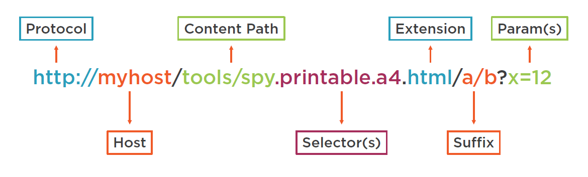
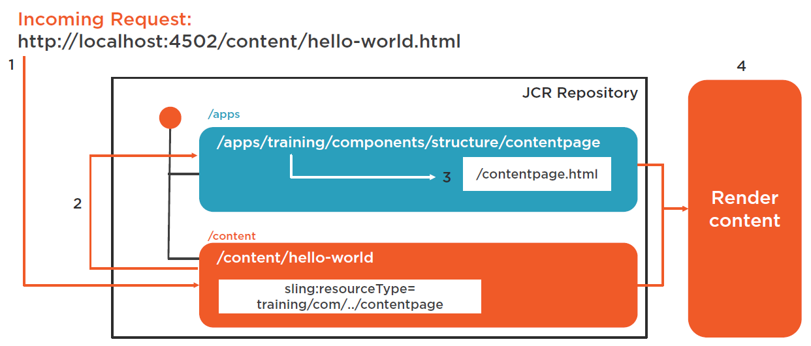

# Sling

## What Is Apache Sling

- Framework for content-driven applications
- Built as bundles in OSGi
- Maps all requests to “Resources”, generally Nodes in the JCR
- Includes utilities and helpers:
  - Adapter API
  - Sling Models
  - Servlet API
  - Jobs / Scheduler

## Sling Concepts: Resource Resolution

- Process to resolve and serve all requests in Apache Sling
- Flexible, extensible model based on naming conventions
- Key concept: content, not application first

## How Does Sling Resolve Requests

PS: XX/ means XX folder

1. Create folders
   1. Create training/ under apps/
   2. Create components/ and templates/ under training/
   3. Create content/ and structure/ under components/
2. Create a Component
   1. Right click components/, create component `contentpage`
   2. Using a html as a default rendering script. The name of html file should be the same as component name
3. Create a content node
   1. Under content/, create node `hello-world`
   2. Add `sling:resourceType = training/components/structure/contentpage` as a node property
4. Render content
   1. In browser, using `http://localhost:4502/content/hello-world.html` to render the Component

当在浏览器中输入 URL 时，`/content/hello-world.html`指向 JCR 中的`/content/hello-world`节点。在这个节点上，`sling:resourceType`指向`training/components/structure/contentpage`这个 Component。然后就会渲染这个 Component 的 Render Script，返回给浏览器。

具体的步骤为：

1. Decompose the URL

   

2. Search for servlet or vanity URL redirect
3. Search for a node indicated by the URL
4. Resolve the resource

   

5. Resolve the rendering script/servlet
6. Create rendering chain
7. Invoke rendering chain


注意，图中的数字编号与上面描述不匹配。

## Sling Concepts: Adaption

- Enables “adapting” an object to another type
- Exposes different methods and functionality for the same data
- You can create custom AdapterFactories

```java
import org.apache.sling.api.Resource;
import java.jcr.Node;
public void doAdaptation(Resource resource){
   // I’m adapting my Sling Resource to a JCR Node
   Node node = resource.adaptTo(Node.class);
   // Now I can use this as a node
   node.checkin();
}
```

## Sling Resources

- [Apache Sling](https://sling.apache.org/)
- [Apache Sling 9 JavaDocs](https://sling.apache.org/apidocs/sling9/index.html)

## Sling Servelt

Servelt 接口定义了 Servlet 的生命周期。所有 Servlet 都需要实现 Servelt 接口。

### sling.servlet.resourceTypes VS sling.servlet.path

sling.servlet.resourceTypes 绑定到 resourceType，sling.servlet.path 绑定到路由路径。推荐使用 sling.servlet.resourceTypes。在项目自动生成的 SimpleServlet 中，

```java
@Component(service=Servlet.class,
           property={
                   Constants.SERVICE_DESCRIPTION + "=Simple Demo Servlet",
                   "sling.servlet.methods=" + HttpConstants.METHOD_GET,
                   "sling.servlet.resourceTypes="+ "demoproject/components/structure/page",
                   "sling.servlet.extensions=" + "txt"
           })
```

当把上面的代码中的 txt 改为 html 后，访问 `http://localhost:4502/editor.html/content/demoproject/en.html` ,由于

1. 该节点的`sling:resourceType="demoproject/components/structure/page"`
2. URL 的`extensions="html"`，与 Servelt 中的一致

所以调用了该 Servlet。

## Sling Other

### 在 HTL 中增加 selectors

1. 新增 Render Script
2. `<form class="page__print" action="${currentPage.Path @ selectors='print'}.html"> <input value="Print Friendly" type="submit" /> </form>` 传入 selectors

### Sling Resource Merger

Sling Resource Merger 用于 AEM 的覆盖和继承。

- overlay
  复制 lib/下的 Component 到 apps/下。由于 AEM 自带的 search path 会先从 apps/寻找，apps/下的 Component 会先起作用。AEM6.0 之后，Sling Resource Merger 在 overlay 上起作用，不需要 1：1 复制 lib/下某个 Component 的所有节点和属性。

  ```bash
  /libs/sling/example (nt:folder)
     +-- sling:resourceType = "some/resource/type"
     +-- child1 (nt:folder)
     |   +-- property1 = "property from /libs/sling/example/child1"
     +-- child2 (nt:folder)
     |   +-- property1 = "property from /libs/sling/example/child2"
     +-- child3 (nt:folder)
     |   +-- property1 = "property from /libs/sling/example/child3"

  /apps/sling/example (sling:Folder)
     +-- property1 = "property added in apps"
     +-- child1 (nt:folder)
     |   +-- sling:hideResource = true // 隐藏！
     +-- child2 (nt:folder)
     |   +-- property1 = "property from /apps/sling/example/child2"
     +-- child3 (nt:folder)
     |   +-- property2 = "property from /apps/sling/example/child3"

  /mnt/overlay/sling/example (sling:Folder)
     +-- sling:resourceType = "some/resource/type"
     +-- property1 = "property added in apps"
     +-- child2 (nt:folder)
     |   +-- property1 = "property from /apps/sling/example/child2"
     +-- child3 (nt:folder)
     |   +-- property1 = "property from /libs/sling/example/child3"
     |   +-- property2 = "property from /apps/sling/example/child3"
  ```

- override
  通过使用`sling:resourceSuperType`属性来继承父类 Component。

  ```bash
  /apps/sling/base (nt:folder)
     +-- child1 (nt:folder)
     |   +-- property1 = "property from /libs/sling/example/child1"
     +-- child2 (nt:folder)
     |   +-- property1 = "property from /libs/sling/example/child2"
     +-- child3 (nt:folder)
     |   +-- property1 = "property from /libs/sling/example/child3"

  /apps/sling/example (sling:Folder)
     +-- sling:resourceSuperType = "/apps/sling/base"
     +-- property1 = "property added in /apps/sling/example"
     +-- child1 (nt:folder)
     |   +-- sling:hideResource = true // 隐藏！
     +-- child2 (nt:folder)
     |   +-- property1 = "property from /apps/sling/example/child2"
     +-- child3 (nt:folder)
     |   +-- property2 = "property from /apps/sling/example/child3"

  /mnt/override/apps/sling/example (sling:Folder)
     +-- sling:resourceSuperType = "/apps/sling/base"
     +-- property1 = "property added in /apps/sling/example"
     +-- child2 (nt:folder)
     |   +-- property1 = "property from /apps/sling/example/child2"
     +-- child3 (nt:folder)
     |   +-- property1 = "property from /libs/sling/example/child3"
     |   +-- property2 = "property from /apps/sling/example/child3"
  ```

[参考文章](https://aemvardhan.wordpress.com/2017/02/22/understand-aem-sling-resource-merger-override-and-overlay-concepts/)

### Redirect

在页面下的 jcr:content 节点上新增`sling:redirectStatus`和`sling:redirect`和`redirectTarget`

## Internationalization

1. 新建一个 fr 的页面，该 fr 为识别符和路径
2. 在 Component 的 HTL 里修改为`${"&copy; {0} We.Train. All rights reserved." @ i18n, format='2017', context='html'}`。其中，`@i18n`表示使用国际化
3. 在 Component 下新增`i18n`节点，在`i18n`节点下新增`fr`节点。`fr`节点新增`jcr:mixTypes="mix:language"`和`jcr:language="fr"`属性
4. 在[i18n-translator](http://localhost:4502/libs/cq/i18n/translator.html)网页上，找到`/apps/training/components/structure/contentpage/i18n`这个节点，点击`Add`，增加翻译并保存
5. 此时，在`i18n`节点上刷新，应该能看到新增的翻译
6. 打开 fr 页面，看到翻译后的语言
