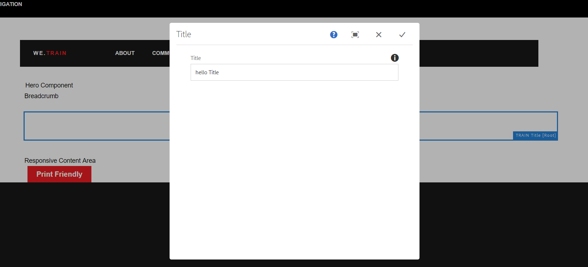
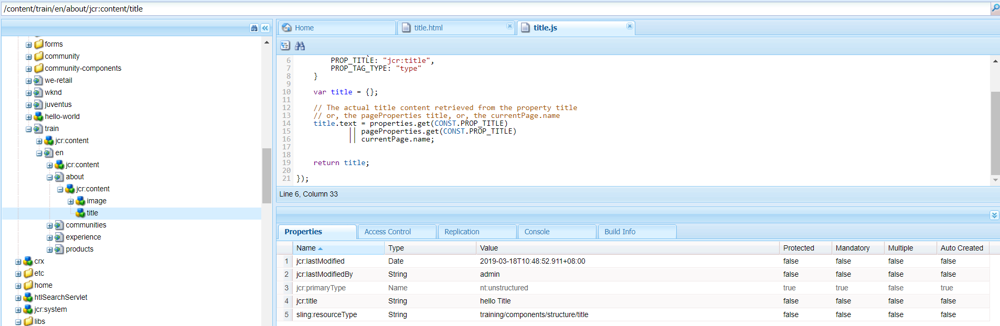
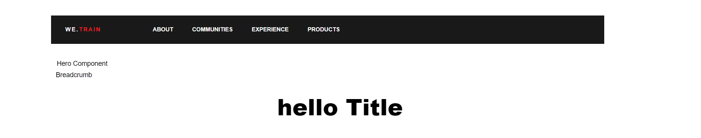

# JCR

## What is Java Content Repository

- Specification for an unstructured content repository
  - Similar to a large XML Document
  - Composed of Nodes and Properties
- JSR-283 specification defines standard and API
- Implemented in AEM by Apache Jackrabbit Oak
- Extended by Adobe’s Granite

## What Does the JCR Provide

- The repository model
- Create, read, update and delete operations
- Sessions and access controls
- Searching
- Observation
- Versioning

## JCR Namespaces & Node Type

- Namespaces allow multiple applications to define types of nodes and properties
- Namespaces are defined with a prefix, delimited by a single colon (:). For example: jcr:title
- Node types define the structure of a Node, including allowed children and allowed properties
- Common node types include: nt:unstructured, nt:file, nt:folder,cq:Page, dam:Asset

## JCR Property Types

- String
- Binary
- Long
- Double
- Date
- Boolean

## JCR Repository Structure

- /apps – custom application code
- /conf – templates and content policies
- /content – all of the web / app content
- /etc – utilities, tools and data
- /home – users and groups
- /oak:index – JCR indexing definitions
- /tmp – working area
- /var – system controlled files, events,
- reports, logs, etc

## JCR Resources

- [Apache Jackrabbit](http://jackrabbit.apache.org/jcr/)
- [Jackrabbit Oak](http://jackrabbit.apache.org/oak/)
- [AEM CRXDE Lite](http://localhost:4502/crx/de)

## node 和 property

node 决定了 JCR 的结构层次，property 决定了 node 的属性。

node 有一个重要属性 jcr:primaryType。它决定了 node 的基本类型，常用的基本类型有 cq:Component 等。常用的类型可查询[官网](https://helpx.adobe.com/in/experience-manager/6-4/sites/developing/using/custom-nodetypes.html)。

官网中的 definition 可参考[Node Type Annotation](http://jackrabbit.apache.org/jcr/node-type-notation.html)

```json
/*  An example node type definition */

// The namespace declaration
<ns = 'http://namespace.com/ns'>

// Node type name
[ns:NodeType]

// Supertypes
> ns:ParentType1, ns:ParentType2

// This node type supports orderable child nodes
orderable

// This is a mixin node type
mixin

// Nodes of this node type have a property called 'ex:property' of type STRING
- ex:property (string)

// The default values for this
// (multi-value) property are...
= 'default1', 'default2'

// This property is the primary item
primary

// and it is...
mandatory autocreated protected

// and multi-valued
multiple

// It has an on-parent-version setting of ...
version

// The constraint settings are...
< 'constraint1', 'constraint2'

// Nodes of this node type have a child node called ns:node which must be of
// at least the node types ns:reqType1 and ns:reqType2
+ ns:node (ns:reqType1, ns:reqType2)

// and the default primary node type of the child node is...
= ns:defaultType

// This child node is...
mandatory autocreated protected

// and supports same name siblings
multiple

// and has an on-parent-version setting of ...
version
```

## Template

Template 用于创建 Page。在创建 Template 的时候，会指定 Tempalte 的`sling:resourceType`指向某个 Component。在创建 Page 时，会将 Template 的`sling:resourceType`属性复制给 Page(整个 Template 下的`jcr:content`节点都会被复制)，从而这个 Page 在 Render 的时候能找到对应 Component 的 Render Script(参考渲染过程)。

### 限制使用 Template

- 在 Template 层面，使用`allowedPaths`属性来限制使用
- 在 Content 层面，使用`cq:allowedTemplates`属性来限制使用

### 优化 Template

以增加 Thumbnail 为例

1. 在 Page 上将需要的 Thumbnail 上传
2. 在 CRXDE 中复制 Page/jcr:content/image 节点，将该节点粘贴至 templates/contactpage/jcr:content 节点下。

## HTL

HTL 是一种模板语言。在服务器端，通过解析 HTL 然后返回 HTML 给浏览器。类似于.net 项目中的 Razor Page(cshtml)。

- Block Statements
  `data-sly-*`
- Expressions
  `${}`

```html
  <!doctype html>
  <html>
    <head>
        <meta charset="utf-8"/>
    </head>
    <body>
        <h1>Hello World!!</h1>
        <h3>Sling PropertiesObject</h3>
        <!-- properties 指向当前 Resource -->
        <p>Page Title : ${properties.jcr:title}</p>

        <h3>Page Details</h3>
        <!-- currentPage 是 Java 对象，真实的方法是 getXX()，实际调用时只需写 ${currentPage.XX} -->
        <p>currentPage Title: ${currentPage.Title}</p>
        <p>currentPage Name: ${currentPage.Name}</p>
        <p>currentPage Path: ${currentPage.Path}</p>
        <p>currentPage Depth: ${currentPage.Depth}</p>

        <h3> Node Details </h3>
        <p>currentNode Name: ${currentNode.Name}</p>
        <p>currentNode Path: ${currentNode.Path}</p>
        <p>currentNode Depth: ${currentNode.Depth}</p>
    </body>
  </html>
```

### data-sly-include

`data-sly-include`主要用于同一个组件内引用其他 html，用于将另一部分内容包含在当前内容。

```html
<!-- contactpage.html -->
<div data-sly-include="body.html"></div>

<!-- body.html -->
<div class="container we-Container--main"></div>

<!-- 最后产生的页面 -->
<div>
    <div class="container we-Container--main"></div>
</div>
```

### data-sly-resource

`data-sly-resource` 主要用于引用其他 Content Component

```html
<!-- header.html -->
<!-- site-topnav 是一个 Component -->
<div data-sly-resource="${'site-topnav' @ resourceType='training/components/structure/site-topnav'}"></div>
```

### data-sly-use

`data-sly-use`用于使用 Java 或 JavaScript 来实现复杂逻辑。

- Java

  ```html
  <div data-sly-use.topnav="TopNav" class="container we-Container--top-navbar"></div>
  ```

- JavaScript

  ```html
  <div data-sly-use.topnav="topNav.js" class="container we-Container--top-navbar"></div>
  ```

## 继承

### 3 种层次关系

- Resource Type 层次关系
  通过 sling:resourceSuperType 属性来决定继承关系
- Container 层次关系
  主要用于给子 Component 配置，常用于 cq:editConfig 和 cq:childEditConfig 属性
- Include 层次关系
  主要用于运行时

### 继承关系的解释

当子类渲染时，通过 sling:resourceSuperType 关联至父类。渲染原则是**子类优先**。

1. 当子类存在对应的 Init Script 时，执行子类的 Init Script
   当子类的 Init Script 调用了父类和子类都有的 Script，优先调用子类的
2. 当子类没有对应的 Init Script，执行父类的 Init Script
   当父类的 Init Script 调用了父类和子类都有的 Script，优先调用子类的

## ClientLib

1. 定义 ClientLib，并定义 categories
2. 在 Compoent 上使用`<sly data-sly-use.clientLib="/libs/granite/sightly/templates/clientlib.html" data-sly-call="${clientLib.(js|css) @ categories='we.train.all'}"/>`来调用 js 或 css

## Dialog

### cq:dialog

分为 Touch UI 和 Classic UI。Touch UI 基于 granite.js，所有可用在 Dialog 里的在`/libs/granite/ui/components`下，Dialog(cq:dialog) 的 sling:resourceType 是`cq/gui/components/authoring/dialog`。

#### 增加 cq:dialog 后的渲染过程

项目状态

- `/content/train/en/about`页面的 sling:resourceType 为`training/components/structure/contentpage`
- `/apps/training/components/structure/contentpage` contentpage Component 中的 Script 引用了 `<div class="we-Header" data-sly-resource="${'title' @ resourceType='training/components/structure/title'}"></div>`
- `/apps/training/components/structure/title` title Component 中的 Dialog 中，指定了 title 的存储位置为`./jcr:title`

`http://localhost:4502/editor.html/content/train/en/about.html` 渲染过程

1. Author 在 About 页面配置 title Component 为`hello Title`
   
2. 点击保存后，title Component 中的 Dialog 中，指定了 title 的存储位置为`./jcr:title`，所以在`/content/train/en/about/jcr:content`下新增 title 节点
   
3. 页面重新加载，找到 contentpage Component，碰到`<div class="we-Header" data-sly-resource="${'title' @ resourceType='training/components/structure/title'}"></div>`
4. 渲染 title Component，`<h1 data-sly-use.title="title.js">${title.text}</h1>`，在 title.js 中`title.text = properties.get(CONST.PROP_TITLE) || pageProperties.get(CONST.PROP_TITLE) || currentPage.name;`,properties 表示当前 resource，也就是`/content/train/en/about/jcr:content/title`,里面存的值是`hello Title`
5. 页面最终效果
   

### cq:editConfig

用于增强 dialog 的功能。

### cq:design_dialog

用于修改全局 content。`cq:design_dialog`来充当 dialog。`etc/designs`存放内容。在`design mode`下打开 dialog。

### cq:dialog & cq:editConfig & cq:design_dialog

- cq:dialog 用于当前 Component 级别的输入。只在当前页面起作用。
- cq:editConfig 用于对 cq:dialog 的增强
- cq:design_dialog 类似于 cq:dialog，但是是在 design mode 下打开，一般在根页面上配置目录，然后在某个页面的 Component 上在 design mode 下调样式或其他，会在全部页面上的对应 Component 上起作用

## Response Grid

### 1. 增加 responsivegrid

1. 在需要 responsivegrid(layout container) 的 Component 上增加
   `<div data-sly-resource="${'responsivegrid' @ resourceType='wcm/foundation/components/responsivegrid'}"></div>`
2. 点击右上角，切换到 design 模式
3. 点击 responsivegrid 上的 parent
4. 点击 responsivegrid 上的 configure
5. 选择可以添加到 responsivegrid 的 component
6. 点击右上角，切换回 edit 模式

### 2. 编辑页面增加 Emulator

在页面节点(jcr:content) 上配置属性`cq:deviceGroups="/etc/mobile/groups/responsive"`

### 3. 允许页面 responsive，在页面右上角出现 layout 模式

在页面节点(jcr:content) 下新增`cq:responsive`节点

// TODO parsys && iparsys && responsivegrid 对比
