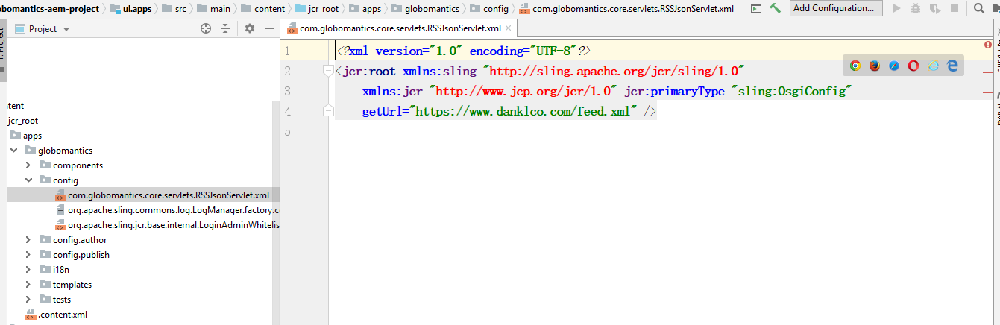
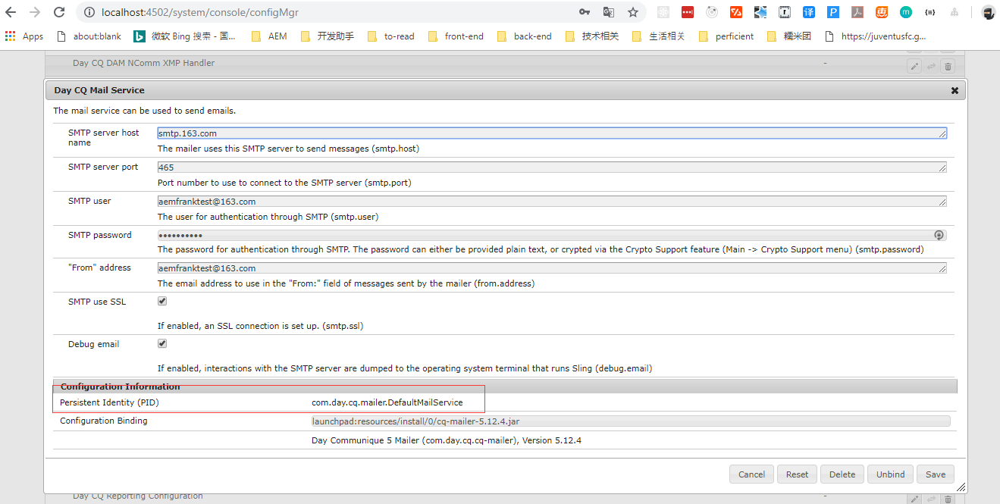
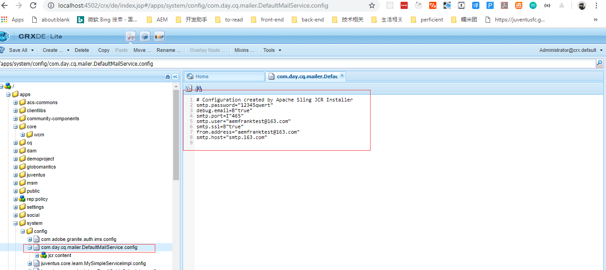

# Confuiguring AEM

## Configurations in AEM

### What is Configurations in AEM

- Provided by OSGi Framework
- Bound to OSGi Components
- Configurable on per environment or per instance

### How to use

[OSGi Configuration Console](http://localhost:4502/system/console/configMgr)

Lists each configurable OSGi Component
Not all OSGi Components have configurations
Console changes saved as config nodes

## Configuring OSGi Services

- Static
  - Used for constant settings and framework configurations
  - Set in Component Annotation
  - Not configurable in Console
  - Retrieved from Map in ComponentContext
- Dynamic
  - Used for dynamic settings and application configurations
  - Set in separate @ObjectClassDefinitioninterface
  - Configurable in console
  - Retrieved from dedicated interface

### Static Configurations

- Set in the property attribute of the @Component annotation
- Set as an array of strings, format: "KEY<:TYPE>=VALUE"
- Set type for non-String types, supported types: Boolean, Byte, Short,Integer, Long, Float, Double, Character
- For multi-properties add multiple values with the same key

### Dynamic Configurations

- Configurations retrievable from separate configuration interface
- Indicate configuration class with: @Designate(ocd = Configuration.class)
- Configuration interface annotation: @ObjectClassDefinition(name = "My Service Configuration”)
- Properties are interface methods with @AttributeDefinition annotations

  - name

    Sets the label for the field

  - cardinality

    - MIN_VALUE=limitless Vector
    - < 0=limited Vector
    - 0=1 value
    - \> 0=limited array
    - MAX_VALUE=limitless array

  - type

    BOOLEAN, BYTE, CHARACTER,DOUBLE, FLOAT, INTEGER,LONG, SHORT, STRING

```java
// Define a Dynamic Configuration
package com.globomantics.core.servlets;

import org.osgi.service.metatype.annotations.AttributeDefinition;
import org.osgi.service.metatype.annotations.ObjectClassDefinition;

@ObjectClassDefinition(name = "RSS JSON Configuration") // 1. Configuration interface annotation
public @interface RSSJsonConfig {

    @AttributeDefinition(name="Feed URL") // 2. Set Properties
    String getUrl();
}
```

```java
// Bind Configuration to Component
package com.globomantics.core.servlets;

import java.io.IOException;
import java.net.URL;

import javax.servlet.Servlet;
import javax.servlet.ServletException;

import org.apache.sling.api.SlingHttpServletRequest;
import org.apache.sling.api.SlingHttpServletResponse;
import org.apache.sling.api.servlets.SlingSafeMethodsServlet;
import org.osgi.service.component.annotations.Activate;
import org.osgi.service.component.annotations.Component;
import org.osgi.service.component.annotations.Reference;
import org.osgi.service.metatype.annotations.Designate;
import org.slf4j.Logger;
import org.slf4j.LoggerFactory;

import com.globomantics.core.RSSJsonService;

@Component(service = Servlet.class, property = { "sling.servlet.resourceTypes=cq:Page",
    "sling.servlet.selectors=rss2json", "sling.servlet.methods=GET" })
@Designate(ocd = RSSJsonConfig.class) // 3. Indicate configuration class
public class RSSJsonServlet extends SlingSafeMethodsServlet {

    private static final long serialVersionUID = -6294355940624972707L;

    private static final Logger log = LoggerFactory.getLogger(RSSJsonServlet.class);

    private String url;

    @Reference
    private RSSJsonService rss2json;

    @Activate
    protected void activate(RSSJsonConfig config) { // 4. Use configuration
        log.info("activate");
        url = config.getUrl();
        log.info("Set url to: {}", url);
    }

    protected void doGet(final SlingHttpServletRequest req, final SlingHttpServletResponse resp)
            throws ServletException, IOException {
        log.trace("doGet");
        try {
            resp.getWriter().write(rss2json.getJson(new URL(url)));
            resp.setContentType("application/json");
        } catch (Exception e) {
            log.error("Exception converting RSS to JSON", e);
        }
    }
}
```

## Storing Configurations

### OSGi Config Node Format

- Stored under /apps/[YOUR APP NAME]/config
- Name of node matches OSGi Component PID
- Stored as sling:OsgiConfig or nt:file with the name [OSGi-Component-PID].config



### Overriding OOTB Configurations

- Update Configuration in OSGi Configuration Console
- Locate config under /apps/cq/core/config or /apps/system/config
- Add configuration to project

Now, I want to override the Mail Service, here are the steps:

1. Link to [configMgr](http://localhost:4502/system/console/configMgr) , configurate the Mail Service

   

2. Link to [CRXDE Console](http://localhost:4502/crx/de/index.jsp#), find the PID

   

   

3. Copy the node `com.day.cq.mailer.DefaultMailService.config` to your project as a config file

   

4. When you update your com.day.cq.mailer.DefaultMailService.config file and install to AEM server, the configuration will be activated.

## Using RunModes + AEM Configurations

### Using RunModes and OSGi Configurations

- Enables setting different configurations per environment or instance
- Stored under /apps/[NAME]/config.[RUN_MODE]
- Multiple Run Modes can be set
