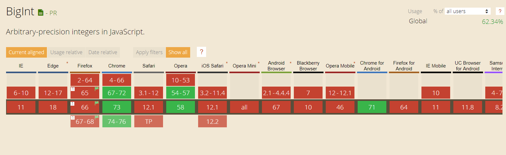
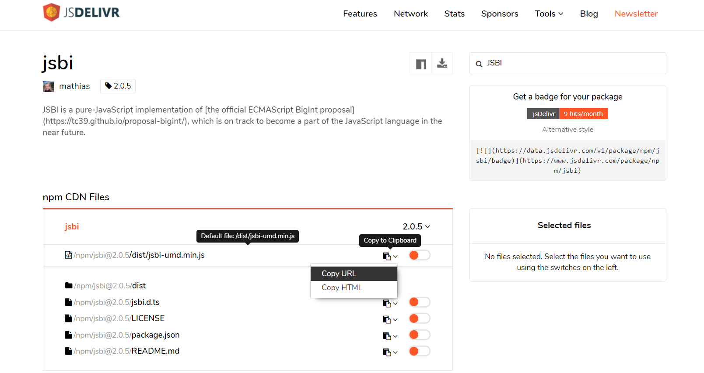

# 第二周(2019-04-07)

## Algorithm - [2. Add Two Numbers](https://leetcode.com/problems/add-two-numbers/)

### Question

You are given two non-empty linked lists representing two non-negative integers. The digits are stored in reverse order and each of their nodes contain a single digit. Add the two numbers and return it as a linked list.

You may assume the two numbers do not contain any leading zero, except the number 0 itself.

Example:

Input: (2 -> 4 -> 3) + (5 -> 6 -> 4)
Output: 7 -> 0 -> 8
Explanation: 342 + 465 = 807.

### Incorrect Answer

以下方法在 ListNode 嵌套层数少的时候还能起作用，当嵌套层数变得特别多，如果还是将 ListNode 计算为 Number 类型，JavaScript 会用科学计数法表示,而且会损失精度。(详情请见 Handle Big Int in JavaScript)

```javascript
const myNumb = 1000000000000000000000;
myNumb + 1 === myNumb; // 加没加竟然一样。。。
```

```javascript
/**
 * Definition for singly-linked list.
 * function ListNode(val) {
 *     this.val = val;
 *     this.next = null;
 * }
 */

var listNode2Array = function(listNode) {
  var result = [];
  result.push(listNode.val);
  while (listNode.next) {
    listNode = listNode.next;
    result.push(listNode.val);
  }
  return result;
};

var array2ListNode = function(arr) {
  var result = arr.reduce(function(accumulator, currenVal) {
    var curNode = new ListNode(currenVal);
    curNode.next = accumulator;
    return curNode;
  }, null);
  return result;
};

/**
 * @param {ListNode} l1
 * @param {ListNode} l2
 * @return {ListNode}
 */
var addTwoNumbers = function(l1, l2) {
  var r1 = listNode2Array(l1)
    .reverse()
    .reduce(function(accumulator, currenVal) {
      return accumulator * 10 + currenVal;
    }, 0);
  var r2 = listNode2Array(l2)
    .reverse()
    .reduce(function(accumulator, currenVal) {
      return accumulator * 10 + currenVal;
    }, 0);

  var result = r1 + r2;
  result = result.toString().split("");
  return array2ListNode(result);
};
```

### Anwser

不要被问题描述误导，其实这个问题只是迭代拿 ListNode 每一层得值并相加，如果有进位进位至下一层，就是这么简单。

```javascript
var addTwoNumbers = function(l1, l2) {
  var List = new ListNode(0);
  var head = List;
  var sum = 0;
  var carry = 0;

  while (l1 !== null || l2 !== null || sum > 0) {
    if (l1 !== null) {
      sum = sum + l1.val;
      l1 = l1.next;
    }
    if (l2 !== null) {
      sum = sum + l2.val;
      l2 = l2.next;
    }
    if (sum >= 10) {
      carry = 1;
      sum = sum - 10;
    }

    head.next = new ListNode(sum);
    head = head.next;

    sum = carry;
    carry = 0;
  }

  return List.next;
};
```

## Review - [BigInt: arbitrary-precision integers in JavaScript](https://developers.google.com/web/updates/2018/05/bigint)

本文讲解了 BigInt 在 V8 引擎上的使用。

Big Int 丢失精度问题在银行等系统中会碰到，以前的解决方法是引用其他库来做运算。Google 在 V8 引擎中内置了 BigInt 类型来解决 Big Int 丢失精度问题。

## Tip - Can I Use 查询浏览器是否支持

使用[Can-I-Use](https://caniuse.com/#search=BigInt)，能查询各个浏览器对 js/css 的支持程度。

## Share - Handle Big Int in JavaScript

在 JavaScript 中进行比较大得 Number 运算时，会碰到如下问题：

```javascript
const myNumb = 1000000000000000000000;
myNumb + 1 === myNumb; // 加没加竟然一样。。。
```

造成这个问题得原因是当 Number 超过 Number.MAX_SAFE_INTEGER 后，会损失精度。

### 以前的解决方案

许多库使用 String 来存储大数来解决这个问题，如 bignum.js。但是，这些库效率没有 BigInt 高。

### BigInt 的解决方案

Chrome 等特定中引入了 BigInt 类型来解决大数问题。



通过查询[Can-I-Use](https://caniuse.com/#search=BigInt),发现这个解决方案在大部分浏览器不适用。

创建 BigInt 很简单：

```javascript
// Use BigInt()
var a = BigInt(123); // 123n

// Add suffix n
var b = 123n; // 123n

typeof a; // bigint
typeof b; // bigint
```

使用 BigInt 进行运算：

```javascript
1234567890123456789 * 123; // 151851850485185200000 损失精度

1234567890123456789n * 123n; // 151851850485185185047n 精度无损失
```

因为现在还有许多浏览器还没内置 BigInt 类型，可以 Polyfilling and transpiling BigInts。由于 BigInt 的特殊性，BigInt 跟普通的 Polyfilling 不一样，BigInt 的代码不能转化为 ES5 标准。但是，Google 开发的 JSBI 库能用于各个浏览器。

```javascript
// 使用JSBI库
import JSBI from "./jsbi.mjs";

const max = JSBI.BigInt(Number.MAX_SAFE_INTEGER);
console.log(String(max));
// → '9007199254740991'
const other = JSBI.BigInt("2");
const result = JSBI.add(max, other);
console.log(String(result));
// → '9007199254740993'
```

如果需要直接在浏览器能使用，可以使用`<script src="https://cdn.jsdelivr.net/npm/jsbi@2.0.5/dist/jsbi-umd.min.js"></script>`脚本。寻找这个脚本的方法如下：

1. Get to [cdn](https://www.jsdelivr.com/)
2. Search "JSBI", and get to [jsbi](https://www.jsdelivr.com/package/npm/jsbi)
3. Copy the jsbi cdn url
   
