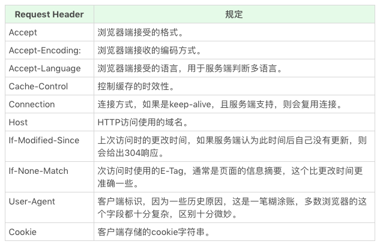

# Browser

## 实现原理

浏览器的功能，可以理解为把一个 URL 变为屏幕上显示的网页。
从 server 返回的数据并非想象的一步做完才能接着下一步，而是一条流水线，即不需要前一步完全完成，下一步就开始处理上一步的输出，这也是我们浏览页面时页面逐步出现的原因。

### HTTP 协议

#### HTTP 方法

- GET
- POST
- HEAD
- PUT
- DELETE
- CONNECT
- OPTIONS
- TRACE

#### HTTP Status Code 和 Status Text

- 1xx: 临时回应，表示客户端请继续。一般浏览器 http 库会直接处理，所以平时见不到
- 2xx: 请求成功
  - 200: 请求成功
- 3xx: 请求目标资源有变化
  - 301: 目标资源永久性转移
  - 302: 目标资源临时性转移
  - 304: 客户端缓存没有更新
- 4xx: 客户端请求错误
  - 403: 无权限
  - 404: 页面不存在
- 5xx: 服务器请求错误
  - 500: 服务器端错误
  - 503: 服务器端暂时错误，可以一会再试

[在线模拟 HTTP 状态码](https://httpstat.us/)

#### HTTP Head

#### HTTP Body

- Request Body: 只要服务器端认可就可以
  - application/json
  - application/x-www-form-urlencoded
  - multipart/form-data
  - text/xml
- Response Body: 根据 Request Head 中的 Accept 等来决定 Response Body 类型

### 解析和构建 DOM

感性认识：Response Body 返回回来的 HTML 字符流经过状态机处理，形成 tokens。然后通过栈构建 DOM。

由于字符流是逐步进入的，下一个进来的字符会决定前面字符的 token 类型，所以用状态机来创建 token。图中，红色的 data 是状态机的初始状态。

[在线 DOM 构建器](https://software.hixie.ch/utilities/js/live-dom-viewer/)

### 计算 CSS

CSS 计算把 CSS 规则应用到 DOM 上。由于 DOM 是渐进式的，CSS 规则保证选择器在构建当前 DOM 节点时，已经可以判断是否匹配，无需后续节点信息。

### 渲染/合成/绘制

## API

### DOM

### CSSOM

### 事件

### API 总集合
