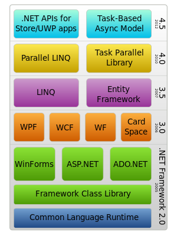

# C Sharp basic

## ABP 框架

### ASP.NET Core & Entity Framework

1. `.Core`中： 新增`Task.cs` 作为 Entity
2. `.EntityFramework`中： 修改`SimpleTaskAppDbContext.cs`，增加 DbSet
3. `命令行`中：`Add-Migration` 和 `Update-Database` 更新数据库。报错需修改为 `Server=(localdb)\mssqllocaldb`
4. `.Application`中： 新增`TaskAppService.cs`(以及单元测试)/`输入DTO`/`输出DTO`
5. `.Web`中：
   - 修改`SimpleTaskAppNavigationProvider.cs`,新增类目
   - 新增`TasksController.cs` --controller
   - 新增`IndexViewModel.cs` --model
   - 新增`Index.cshtml` -- view

### ASP.NET MVC, Web API, EntityFramework & AngularJS

1. `.Core`中： 新增`Task.cs`和 `Person.cs`作为 Entity
2. `.EntityFramework`中： 修改`SimpleTaskAppDbContext.cs`，增加两个`IDbSet`
3. 关联数据库
   1. `.Web`中：
      1. 修改`Web.config`,使 Server 指向(localdb)\\mssqllocaldb
      2. 修改`Configuration.cs`,产生种子数据
   2. `Console`中：
      1. `Add-Migration "InitialCreate"`产生 migration 文件。执行该步骤时需要将`.Web`设为 startup project
      2. `Update-Database`更新数据库
4. 新增 Repository，用以操作数据库
   1. `.Core`中：新增`ITaskRepository.cs`
   2. `.EntityFramework`中：新增`TaskRepository.cs`
5. `.Application`中：新增`TaskAppService.cs`(以及单元测试)/`输入DTO`/`输出DTO`
6. `.WebApi`中，自动暴露 Service 给外部调用
7. `.Web`中使用 Angular

## VS shortcuts

1. `Alt+Enter` to give show tips
2. `Ctrl+F5` to run application without debug
3. `F5` to run in debug mode
4. `Ctrl+Shift+B` to compile
5. Input `cw` then press `Tab` twice to insert `Console.writeLine();`
6. `F9` to put a break point
7. `Ctrl+Tab` to switch window

## .NET structure

`.NET`主要包括`Common Language Runtime`和`Framework Class Library`。`ASP.NET`是基于`.NET`的一个开发 Web 应用的框架。



## Types

### Value Types: struct

- byte/short/int/long
- float/double/decimal
- char
- bool
- DateTime
- enum

### Reference Types: class

- String
  but behave like a value type.
- Array

  ```c#
  int[] scores = new int[5] // initial a int array
  ```

- Class
- List

## Constructor

- `: this()` to use other constructors

## Access Modifier

| 修饰符    | 作用域                                                 |
| --------- | ------------------------------------------------------ |
| public    | Everywhere                                             |
| private   | Only in the same class。是类中属性及行为的默认修饰符。 |
| internal  | Only in the same assembly。是类的默认修饰符。          |
| protected | 子类可访问到父类。                                     |

## Delegates And Events

Delegate 是指向方法的类型，类似于 JS 中的方法赋值给一个变量。

```javascript
var a = x => x;
var delegateA = a;
```

在 C#中，经常用 event 来解决`publisher`和`subscriber`的问题。

### 困境

```c#
public class VideoEncoder
{
    public void Encode(Video video)
    {
        // encode code
        _mailService.Send(new Mail());
    }
}
```

在如上代码中，将 Video 进行编码，编码结束后发邮件通知。现在有新的需求，需要再发送短信，一般的方法是:

```c#
public class VideoEncoder
{
    public void Encode(Video video)
    {
        // encode code
        _mailService.Send(new Mail());
        _messageService.Send(new Text()); // add this code
    }
}
```

但是，上面的代码不够美观，这种类似的问题可以抽象为`publisher`和`subscriber`的问题。这里，`VideoEncoder.Encode()`是`publisher`，邮件及信息服务为`subscriber`。

### 在 C#中建立 Event 的方法

1. 定义一个`delegate`
2. 基于`delegate`定义`event`
3. 发起`event`

```c#
public class VideoEncoder
{
    // 1. define a delegate
    public delegate void VideoEncodeHandler(object sender, VideoEventArgs args);

    // 2. define an event
    public event VideoEncodeHandler VideoEncoded;

    public void Encode(Video video)
    {
        // encode stuff
        //...

        // 3. raise the event
        OnVideoEncoded(video);
    }

    protected virtual void OnVideoEncoded(Video video)
    {
        if(VideoEncoded != null)
        {
            VideoEncoded(this, new VideoEventArgs{ video = video });
        }
    }
}
```

### 创建 subscriber

```c#
public class MailService
{
    public void OnVideoEncoded(object sender, VideoEventArgs args)
    {
        // ...
    }
}
```

### 调用

```c#
static void Main(string[] args)
{
    var video = new Video();
    var videoEncoder = new VideoEncoder(); // publisher
    var mailService = new MailService(); // subscriber

    videoEncoder.VideoEncoded += mailService.OnVideoEncoded; // subscription

    videoEncoder.Encode(video);
}
```

## 继承

### 父类

```c#
class Father
{
    public virtual void getMsg() // 如果不加virtual，会执行定义的类型，即Fathe类型r。
        //如果定义了virtual，就会执行运行时的对象，即Son。在这种情况下，子类重写的方法需要加上override修饰
    {
        Console.WriteLine("hello, I'm father...");
    }
}
```

### 子类

```c#
class Son : Father
{
    public override void getMsg()
    {
        base.getMsg();
        Console.WriteLine("hello, I'm son...");
    }
}
```

### 调用子类的方法

```c#
static void Main(string[] args)
{
    Father father = new Son();
    father.getMsg();
    // hello, I'm father...
    // hello, I'm son
}
```

## 抽象类

`a()`继承自祖父抽象类，祖父类中用`abstract`修饰，后代都用`override`修饰。

`b()`来自父类普通类，父类中用`virtual`修饰，后代用`override`修饰。

```c#
// GrandFather
public abstract class A
{
    public abstract void a();
}

// Father
public class B : A
{
    public override void a()
    {
        System.Console.WriteLine("B...");
    }
    public virtual void b()
    {
        System.Console.WriteLine("BB...");
    }
}

// Son
public class C : B
{
    public override void a()
    {
        System.Console.WriteLine("C...");
    }
    public override void b()
    {
        System.Console.WriteLine("CC...");
    }
}
```

## 接口

```c#
// interface
public interface IA
{
    void a();
    void say();
}

// GrandFather
public abstract class A : IA
{
    public virtual void a() //实现了接口的a()。在抽象类中实现了具体方法。
    {
        // ...
    }

    public void say()  //实现了接口的say()。由于子类并不用重写该方法，所以不用virtual修饰。
    {
        // ...
    }

    // public abstract void a(); // 实现了接口。但是不在抽象类中书写具体方法。

}

// Father
public class B : A
{
    public override void a()
    {
        System.Console.WriteLine("B...");
    }
    public virtual void b()
    {
        System.Console.WriteLine("BB...");
    }
}

// Son
public class C : B
{
    public override void a()
    {
        System.Console.WriteLine("C...");
    }
    public override void b()
    {
        System.Console.WriteLine("CC...");
    }
}
```

## Generics 泛型

```c#
// 1. 定义泛型类
public class CircularBuffer<T> // 类名后增加泛型标识
{
    private T[] _buffer; // 使用泛型定义field

    public CircularBuffer(int capacity)
    {
        _buffer = new T[capacity + 1];
    }

    public void Write(T value) // 使用泛型定义方法参数
    {
        _buffer[_end] = value;
        _end = (_end + 1) % _buffer.Length;
        if (_end == _start)
        {
            _start = (_start + 1) % _buffer.Length;
        }
    }

    public T Read()  // 使用泛型定义方法返回类型
    {
        T result = _buffer[_start];
        _start = (_start + 1) % _buffer.Length;
        return result;
    }
}

// 2. 使用泛型类
var buffer = new CircularBuffer<double>();
```

## 集合

| Name                           | Strengths                                         |
| :----------------------------- | ------------------------------------------------- |
| **Array**                      | Such as int[]                                     |
| **List<T>**                    | A growing array                                   |
| Queue<T>, Stack<T>             | For FIFO and LIFO                                 |
| Hashset<T>                     | Unique items only                                 |
| LinkedList<T>                  | Flexible inserts                                  |
| **Dictionary<TKey, TValue>**   | Quick look up by key                              |
| SortedSet<T>                   | Sorted & unique                                   |
| SortedList<TKey, TValue>       | Sorted& memory efficient                          |
| SortedDictionary<TKey, TValue> | Sorted, fast inserts and removals                 |
| Concurrent Collections         | Multiple writers and readers                      |
| ImmutableCollections           | Thread safe,modifications produce new collections |

## null 相关

```c#
Nullable<int> i = null;
int? i = null;

int i = null; //error
```
