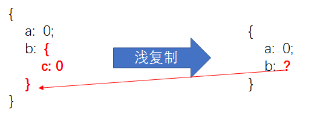

# Closure vs. Object

这是 Closure

```javascript
function outer() {
  var one = 1;
  var two = 2;

  return function inner() {
    return one + two;
  };
}

var three = outer();

three(); // 3
```

这是 Object

```javascript
var obj = {
  one: 1,
  two: 2
};

function three(outer) {
  return outer.one + outer.two;
}

three(obj); // 3
```

由此可知，Closure 和 Object 能完成一样的事情，是一个事物的两面。

## 复制的常用方法

JS 中的浅拷贝与深拷贝，只是针对复杂数据类型（Object，Array）的复制问题。

### 浅复制


浅复制只复制一层对象的属性。浅复制适用于数组或对象里的属性为原生类型，当用于非原生类型时，会造成错误。

#### ... 浅复制数组

```javascript
// 原生
var a = [1, 2, 3];
var b = [...a];
b.push(4);

a; // [1,2,3]
b; // [1,2,3,4]
// 非原生
var a = [
  {
    name: "frank"
  },
  {
    name: "hu"
  }
];
var b = [...a];
b[0].name = "hello";
console.log(a); // [{name: "hello"},{name:"hu"}] 更改b但对a也有影响
console.log(b); // [{name: "hello"},{name:"hu"}]
```

#### ...或 Object.assign 浅复制对象

```javascript
// 原生
var o = {
  x: 1,
  y: 2
};

// in ES2018+, using object spread:
var p = { ...o };
p.y = 3;

// in ES6/ES2015+:
var p = Object.assign({}, o);
p.y = 3;
// 非原生
var o = { a: 0, b: { c: 0 } };
var p = Object.assign({}, o);
p.b.c = 10;
p.b.d = 10086;
console.log(o); // {a: 0,b:{c: 10,d:10086}} o变化了！
console.log(p); // {a: 0,b:{c: 10,d:10086}}
```

### 深复制

深复制递归复制了所有层级。

#### JSON.parse(JSON.stringify(object)) 深复制对象

```javascript
var objectIsNew = JSON.parse(JSON.stringify(objectIsOld));
```

#### Lodash.\_.cloneDeep(value) 深复制对象或数组

```javascript
var objects = [{ a: 1 }, { b: 2 }];

var deep = _.cloneDeep(objects);
console.log(deep[0] === objects[0]); // false
```
