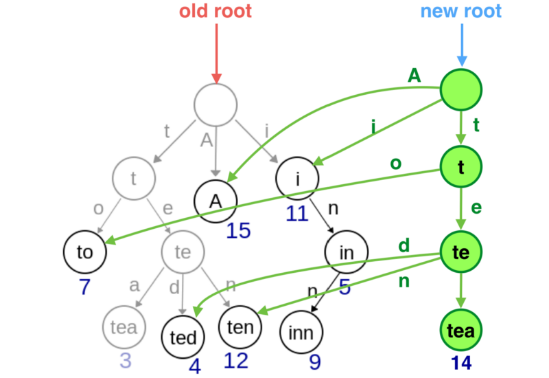

# Value Immutability

## 原生类型的不可改变性

number, string, boolean, null, 和 undefined 是原生的，不可改变。

```javascript
2 = 3 // 错误。原生的不能改变。
```

## 非原生类型的不可改变性

非原生类型是通过引用连接的，很容易在传入函数的过程中被更改。需要尽量避免这种情况的发生。

```javascript
var arr = [1, 2, 3];
foo([...arr]); // 传入foo的是新的array，是原来arr的复制。
console.log(arr[0]); // 1
```

## const 用于修饰原生类型

constant：一个无法被重新赋值的常量。对于原生类型来说就是无法被重新赋值，对于非原生类型来说，是指引用无法被更改，但是引用指向的对象可以被更改。

```javascript
const arr = [1, 2, 3];
arr = [0]; // 错误
arr[0] = "frank"; // 指向的对象中的值可以被更改
arr; // ["frank", 2, 3]
```

那么问题来了，我们在定义 const 时候，会想当然觉得 arr 里的值是不能变的，但从以上例子可以看出，arr 里的值是可以改变的。那么，我们还要用 const 来声明非原生变量，合适吗？  
所以，`尽量避免使用const来修饰非原生变量，因为会让代码阅读者产生歧义。`

## [Immutable](https://facebook.github.io/immutable-js/) 提升性能


上图中，当对 tea 节点进行了更改，会同时更改 tea 的父类节点，但其余节点不予修改，由此进行性能提升。

```javascript
var state = Immutable.List.of({ a: "frank" }, 6, 1, { b: "frank" });

var newState = state.set(0, { a: "lifan" });
console.log(state.get(0) === newState.get(0)); // false. state和newstate指向了不一样的对象。
console.log(state.get(3) === newState.get(3)); // true.还是指向原来的{b:"frank"}。
```

## 需要避免使用的方法

```javascript
// 以下方法会产生副作用
splice(..);
pop(..);
push(..);
shift(..);
unshift(..);
reverse(..);
sort(..);
fill(..);
```
