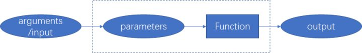

# 参数转化

[FP](https://en.wikipedia.org/wiki/Functional_programming)比较火，最近刚好项目上比较清闲，找了本 YDKJS 的作者写的[Functional-Light-JS](https://github.com/getify/Functional-Light-JS)进行学习。



## Function vs Procedure

函数会返回值，过程告诉计算机具体执行步骤，计算机只是按照顺序执行命令。最好保证函数是没有副作用的。

## parameters VS arguments

* parameters: 形参。定义函数时的参数。functionName.length 获取形参个数。
* arguments: 实参。调用函数时的参数。arguments.length 获取获取实参个数。

In a parameter list, we said it gathered arguments together. In an argument list, it spreads them out.

```javascript
function foo(...args) {
  // 形参调用，gather参数
  console.log(args[3]);
}

var arr = [1, 2, 3, 4, 5];

foo(...arr); // 实参调用，spreads参数

function foo(x = 3) {
  console.log(x);
}

foo(); // 3
foo(undefined); // 3
foo(null); // null
//只有没传参数或显示传入undefined,才会使用默认值x=3
foo(0); // 0
```

## All for One: unary 多个实参过滤到 1 个实参

```javascript
/* unary */
function unary(fn) {
  return function onlyOneArg(arg) {
    return fn(arg);
  };
}
const arr = ["1", "2", "3"];
//const newArray = arr.map(item => parseInt(item));
const newArray = arr.map(unary(parseInt));
console.log(newArray);
```

## One on One: identity 传入什么返回什么

```javascript
function identity(v) {
  return v;
}
const words = "   Now is the time for all...  ".split(/\s|\b/);
console.log(words);
//const newWords = words.filter(item => item !== "");
const newWords = words.filter(identity);
console.log(newWords);
```

## Unchanging One: constant 传入一个值，返回一个函数

```javascript
/* Unchanging One */
// 许多API需要传入一个函数，而不是一个值。
// doesn't work:
p1
  .then(foo)
  .then(p2)
  .then(bar);

// instead:
p1
  .then(foo)
  .then(function() {
    return p2;
  })
  .then(bar);

function constant(v) {
  return function value() {
    return v;
  };
}
//上面的例子可以改写为：
p1
  .then(foo)
  .then(constant(p2))
  .then(bar);
```

## Adapting Arguments to Parameters: 定义新的方法，将 arguments 和 parameters 的格式统一

```javascript
/* spreadArgs */
function spreadArgs(fn) {
  return function spreadFn(argsArr) {
    return fn(...argsArr);
  };
}
function foo(x, y) {
  console.log(x + y);
}

function bar(fn) {
  fn([3, 9]);
}

bar(spreadArgs(foo));
/* gatherArgs */
function gatherArgs(fn) {
  return function gatheredFn(...argsArr) {
    return fn(argsArr);
  };
}
function foo1(args) {
  console.log(args[0] + args[1]);
}

function bar1(fn) {
  fn(3, 9);
}
bar1(gatherArgs(foo1));
```

## partial 部分参数

经常会碰到的问题：调用一个函数，有一些参数已经确定，但还有一些参数暂时无法确定。如何来简化这些操作呢？比如：

```javascrpt
function ajax(url,data,callback){} //url已经确定，但data或callback没有确定。
```

在 FP 中，经常使用*partial*函数。

```javascript
function partial(fn, ...presetArgs) {
  return function partiallyApplied(...laterArgs) {
    return fn(...presetArgs, ...laterArgs);
  };
}
```

经典场景

```javascript
function add(x, y) {
  return x + y;
}
[1, 2, 3, 4, 5].map(function adder(val) {
  return add(3, val);
});
// [4,5,6,7,8]
```

由于 map 和 add 签名不一致，所以经常使用这种写法。在 FP 中，更优雅的写法是：

```javascript
[1, 2, 3, 4, 5].map(partial(add, 3));
// [4,5,6,7,8]
```

## partialRight

partialRight 是 partial 的反面。

```javascript
function partialRight(fn, ...presetArgs) {
  return function partiallyApplied(...laterArgs) {
    return fn(...laterArgs, ...presetArgs);
  };
}
```

这个方法比较特殊，保证 presetArgs 永远是 fn 执行的最后一个参数。

```javascript
function foo(x, y, z, ...rest) {
  console.log(x, y, z, rest);
}

var f = partialRight(foo, "z:last");

f(1, 2); // 1 2 "z:last" []

f(1); // 1 "z:last" undefined []

f(1, 2, 3); // 1 2 3 ["z:last"]

f(1, 2, 3, 4); // 1 2 3 [4,"z:last"]
```

## Curry 科里化

Curry 是指将多参数的函数转换为每次只接受一个参数的函数。可以将多元函数转为一元函数，便于人类理解。

```javascript
ajax(url, data, callback);
curriedAjax(url)(data)(callback);
```

### Curry vs Partial

Curry 后的函数每次只接受一个参数。Partial 后的函数可以同时接收多个参数。

```javascript
function curry(fn, arity = fn.length) {
  return (function nextCurried(prevArgs) {
    return function curried(nextArg) {
      var args = [...prevArgs, nextArg];

      if (args.length >= arity) {
        return fn(...args);
      } else {
        return nextCurried(args);
      }
    };
  })([]);
}

function add(x, y) {
  return x + y;
}

curry(add)(1)(3);
```

## uncurry 反科里化

```javascript
function uncurry(fn) {
    return function uncurried(...args){
        var ret = fn;

        for (let arg of args) {
            ret = ret( arg );
        }

        return ret;
    };
}
```

## No Points 减少无谓的形参/实参映射

```javascript
function double(x) {
  return x * 2;
}

[1, 2, 3, 4, 5].map(function mapper(v) {
  return double(v);
});
// [2,4,6,8,10]
```

在上面的代码中，mapper 是完全没必要去定义的，它只是简单的把 v 传入 double，然后返回 double 的结果。完全可以写为：

```javascript
function double(x) {
  return x * 2;
}

[1, 2, 3, 4, 5].map(double);
// [2,4,6,8,10]
```
