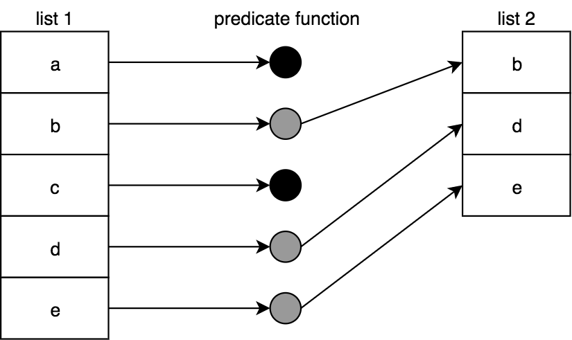

# 常用的 FP 方法

## Map


### ES6 自带的 Map

```javascript
array.map(function(currentValue,index,arr), thisValue)
```

`var newArray = oldArray.map(fn)` 传入 array 里的每个值，每个值 fn 后产生新值，新值组装为新的 array 返回。

### FP 里的 Map

FP 里的 Map 写法有点不一样，但是原理上是一致的。

```javascript
function map(mapperFn, arr) {
  var newList = [];

  for (let [idx, v] of arr.entries()) {
    newList.push(mapperFn(v, idx, arr)); // 与ES6一致
  }

  return newList;
}
```

### Functor

1. A functor is a value that has a utility for using an operator function on that value, which preserves composition.

2. Functor is `an object` that has `map` function. For Example, Array is a functor.本人更倾向于该种说法。

## Filter



```javascript
function filter(predicateFn, arr) {
  var newList = [];

  for (let [idx, v] of arr.entries()) {
    // 根据结果判断，如果为true，加入newList
    if (predicateFn(v, idx, arr)) {
      newList.push(v);
    }
  }

  return newList;
}
```

## Reduce

Reduce 有两种方式：

1. 指定初始值：
    
2. 不指定初始值，array 里的第一个值作为初始值：
    

### ES6 自带的 reduce

```javascript
arr.reduce(callback[, initialValue])

array.reduce(function(accumulator, currentValue, currentIndex, arr), initialValue); // 有initialValue
或
array.reduce(function(accumulator, currentValue, currentIndex, arr)); // 没有initialValue
```

### FP 里的 reduce

```javascript
function reduce(reducerFn, initialValue, arr) {
  var acc, startIdx;

  if (arguments.length == 3) {
    // 提供initialValue
    acc = initialValue;
    startIdx = 0;
  } else if (arr.length > 0) {
    // 不提供initialValue
    acc = arr[0];
    startIdx = 1;
  } else {
    throw new Error("Must provide at least one value.");
  }

  for (let idx = startIdx; idx < arr.length; idx++) {
    acc = reducerFn(acc, arr[idx], idx, arr);
  }

  return acc;
}
```

## Unique

筛选 array 里不重复的

```javascript
var unique = arr => arr.filter((v, idx) => arr.indexOf(v) == idx);

unique([1, 4, 7, 1, 3, 1, 7, 9, 2, 6, 4, 0, 5, 3]);
// [1, 4, 7, 3, 9, 2, 6, 0, 5]
```

## Flatten

```javascript
var flatten = arr =>
  arr.reduce((list, v) => list.concat(Array.isArray(v) ? flatten(v) : v), []);

flatten([[0, 1], 2, 3, [4, [5, 6, 7], [8, [9, [10, [11, 12], 13]]]]]);
// [0,1,2,3,4,5,6,7,8,9,10,11,12,13]
```

## Zip

```javascript
function zip(arr1, arr2) {
  var zipped = [];
  arr1 = [...arr1];
  arr2 = [...arr2];

  while (arr1.length > 0 && arr2.length > 0) {
    zipped.push([arr1.shift(), arr2.shift()]);
  }

  return zipped;
}

zip([1, 3, 5, 7, 9], [2, 4, 6, 8, 10]);
// [ [1,2], [3,4], [5,6], [7,8], [9,10] ]
```

## Merge

```javascript
function mergeLists(arr1, arr2) {
  var merged = [];
  arr1 = [...arr1];
  arr2 = [...arr2];

  while (arr1.length > 0 || arr2.length > 0) {
    if (arr1.length > 0) {
      merged.push(arr1.shift());
    }
    if (arr2.length > 0) {
      merged.push(arr2.shift());
    }
  }

  return merged;
}

mergeLists([1, 3, 5, 7, 9], [2, 4, 6, 8, 10]);
// [1,2,3,4,5,6,7,8,9,10]
```

## 自带的方法 VS. 标准化的方法

```javascript
[1, 2, 3, 4, 5]
  .filter(isOdd)
  .map(double)
  .reduce(sum, 0); // 18

// vs.

reduce(map(filter([1, 2, 3, 4, 5], isOdd), double), sum, 0); // 18 该方法不利于阅读
```

### Composing 自带的方法

改进工具箱里的方法：

```javascript
// 绑定this
var partialThis =
    (fn,...presetArgs) =>
        function partiallyApplied(...laterArgs){
            return fn.apply( this, [...presetArgs, ...laterArgs] );
        };
// compose方法
var composeChainedMethods =
    (...fns) =>
        result =>
            fns.reduceRight(
                (result,fn) =>
                    fn.call( result )
                , result
            );
// 符合compose的写法：compose(f1,f2,f3)(args),执行的次序为从右到左。
composeChainedMethods(
   partialThis( Array.prototype.reduce, sum, 0 ),
   partialThis( Array.prototype.map, double ),
   partialThis( Array.prototype.filter, isOdd )
)
( [1,2,3,4,5] );                    // 18
```

### Composing 标准化的方法

```javascript
var filter = (arr, predicateFn) => arr.filter(predicateFn);

var map = (arr, mapperFn) => arr.map(mapperFn);

var reduce = (arr, reducerFn, initialValue) =>
  arr.reduce(reducerFn, initialValue);
// 调用
compose(
  partialRight(reduce, sum, 0),
  partialRight(map, double),
  partialRight(filter, isOdd)
)([1, 2, 3, 4, 5]); // 18
```

或者，使用 curry：

```javascript
var filter = curry((predicateFn, arr) => arr.filter(predicateFn));

var map = curry((mapperFn, arr) => arr.map(mapperFn));

var reduce = curry((reducerFn, initialValue, arr) =>
  arr.reduce(reducerFn, initialValue)
);
// 调用
compose(reduce(sum)(0), map(double), filter(isOdd))([1, 2, 3, 4, 5]);
```

### 自带的方法 => 标准化的方法

以 filter 为例子进行解读：
`obj[methodName](...args)`可以作为`[1, 2, 3, 4, 5].filter(isOdd)`

```javascript
// 包装自带的方法
var unboundMethod = (methodName, argCount = 2) =>
  curry((...args) => {
    var obj = args.pop();
    return obj[methodName](...args);
  }, argCount);
var filter = unboundMethod("filter", 2);
var map = unboundMethod("map", 2);
var reduce = unboundMethod("reduce", 3);
// 以标准化方式调用
compose(reduce(sum)(0), map(double), filter(isOdd))([1, 2, 3, 4, 5]); // 18
```

### 标准化的方法 => 自带的方法

```javascript
var flatten = arr =>
  arr.reduce(
    (list, v) =>
      // note: concat(..) used here since it automatically
      // flattens an array into the concatenation
      list.concat(Array.isArray(v) ? flatten(v) : v),
    []
  );
function flattenReducer(list, v) {
  // note: concat(..) used here since it automatically
  // flattens an array into the concatenation
  return list.concat(Array.isArray(v) ? v.reduce(flattenReducer, []) : v);
}
// 以自带方式调用
[[1, 2, 3], 4, 5, [6, [7, 8]]].reduce(flattenReducer, []);
```
