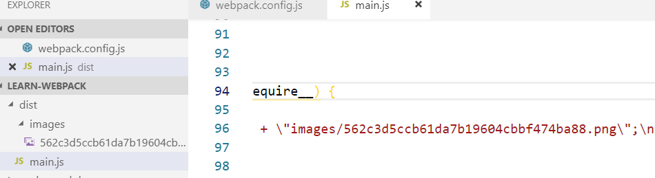
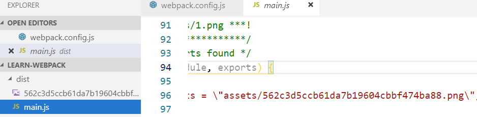

# webpack4 使用指南

webpack 是一种静态模块打包工具，能将所有 asset(Javascript, images, fonts, CSS)打包。[原理性的打包过程](https://github.com/juventusfc/minipack)包括：

1. 生成 AST
2. 生成依赖图
3. IIFE 函数打包，函数参数是依赖图

webpack4 可以实现 0 配置，也可以结合配置文件使用。

## Entry

Entry 指定了打包的起始点。默认值为`./src/index.js`。

### 速记语法

`entry: string|Array<string>`

#### 例子

```javscript
module.exports = {
  entry: './path/to/my/entry/file.js'
};
```

等价于

```javascript
module.exports = {
  entry: {
    main: "./path/to/my/entry/file.js"
  }
};
```

注意，当传入数组时，表示多入口，但是数组中的各个入口文件会打成一个包。

### 对象语法(推荐)

`entry: {[entryChunkName: string]: string|Array<string>}`

```javascript
const config = {
  entry: {
    app: "./src/app.js",
    vendors: "./src/vendors.js"
  }
};
```

```javascript
const config = {
  entry: {
    pageOne: "./src/pageOne/index.js",
    pageTwo: "./src/pageTwo/index.js",
    pageThree: "./src/pageThree/index.js"
  }
};
```

扩展：当使用多个入口文件时，可以使用 CommonsChunkPlugin 来提取公共代码。

## Output

Entry 指定了打包后文件的存放点。打包后的 main 文件的存放点默认值为`./dist/main.js`，其他非 main 文件为`./dist`。

```javscript
const config = {
  output: {
    path: path.resolve(__dirname, 'dist'),
    filename: 'my-first-webpack.bundle.js'
  }
};

module.exports = config;
```

当打包多入口文件时，

```javascript
{
  entry: {
    app: './src/app.js',
    search: './src/search.js'
  },
  output: {
    filename: '[name].js',
    path: __dirname + '/dist'
  }
}
```

### path 和 publicPath

path 指定了 main.js 的生成路径。
publicPath 指定了 main.js 中对 image 等文件的 uri 地址。对于一些静态资源，可能在本地是放在本地文件夹的，但是在生产环境上，静态资源可能在 CDN 上，如果对 main.js 中的每个 uri 都进行手动更改，容易出错和遗漏。引入 publicPath，就能统一对 uri 进行更改了。

## Loaders

Loaders 用于 webpack 识别打包 js/json 文件之外的文件类型。原生 js 是无法直接 require/import 图片的，使用 loader 就能使用

```javascript

```

这种语法了。

### babel-loader

使用 Babel 生成 es5 标准的 js 代码

使用步骤：

1. 安装包依赖：

   ```json
   "babel-core": "^6.26.3",
   "babel-loader": "^7.0.5",
   "babel-preset-env": "^1.7.0",
   ```

2. 配置`webpack.config.js`

   ```javascript
   {
     test: /\.(js|jsx)$/,
     exclude: /node_modules/,
     use: {
       loader: "babel-loader",
       options: {
         presets: ["babel-preset-env"]
       }
     }
   }
   ```

### file-loader

The file-loader resolves import/require() on a file into a url and emits the file into the output directory.
file-loader 将 js 中 import/require()引用的文件内容（image/css）生成到指定的目录，引用的 uri 会自动匹配，使打包后的 bundle 能正常访问文件。
使用步骤：

1. 安装包依赖

   ```bash
   npm install file-loader --save-dev
   ```

2. js 文件中引用

   ```javascript
   import img from "./file.png";
   ```

3. 配置`webpack.config.js`

   ```javascript
   {
     test: /\.(png|jpg|gif)$/,
     use: [
       {
        loader: 'file-loader',
        options: {},
       },
     ],
   }
   ```

options:

- outputPath（类似于`output.path`）

  生成 main.js 时，1. 引用的其他文件会放到这个相对路径下，2. main.js 能正常访问到该路径。注意，outputPath 应该为 main.js 的**相对路径**。也就是说，这个 option 在修改生成的 main.js 同时，会对对图片等文件的生成目录做控制。

  ```javascript
  // index.js
  import image from "./images/1.png";

  //webpack.config.js
  outputPath: "images";
  ```

  生成的目录结构
  

- publicPath （类似于`output.publicPath`）

  生成 main.js 时，1. main.js 中引用其他文件时会增加这个路径前缀,2. 不保证这个路径下有这个文件。也就是说，这个 option 只修改生成的 main.js，对图片等文件的生成目录不做控制。

  ```javascript
  // index.js
  import image from "./images/1.png";

  //webpack.config.js
  publicPath: "assets";
  ```

  生成的目录结构
  

### style-loader 和 css-loader

main.js 中生成 css

使用步骤：

1. 安装包依赖：

   ```json
   npm install css-loader style-loader --save-dev
   ```

2. 配置`webpack.config.js`

   ```javascript
   {
     test: /\.css$/,
     use: [{ loader: "style-loader" }, { loader: "css-loader" }]
   }
   ```

## Plugins

Plugins 用于扩展 webpack 功能，主要是打包优化/asset 管理/环境变量注入等。

```javascript
const HtmlWebpackPlugin = require("html-webpack-plugin"); // 1. require plugin
const webpack = require("webpack"); // 2. to access built-in plugins

const config = {
  // 3. 使用new创建实例，将实例加入plugins数组中
  plugins: [new HtmlWebpackPlugin({ template: "./src/index.html" })]
};

module.exports = config;
```

### HtmlWebpackPlugin

Simplifies creation of HTML files to serve your webpack bundles

webpack 打包所有文件后，用该 plugin 可以创建与 js 匹配 hash 值的 html。

## Mode

模式包括：development, production(默认值) 和 none

```javascript
module.exports = {
  mode: "production"
};
```

## webpack4 react 结合使用

webpack4 和 react 应用能完美结合使用。[点击此处](https://github.com/juventusfc/webpack4-react-template)获取例子
