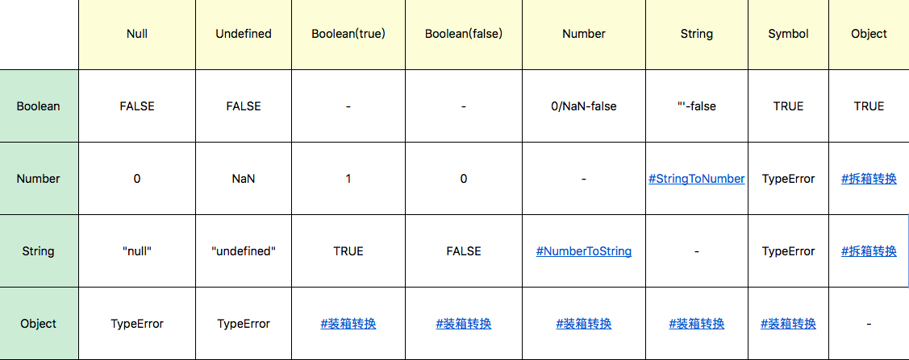
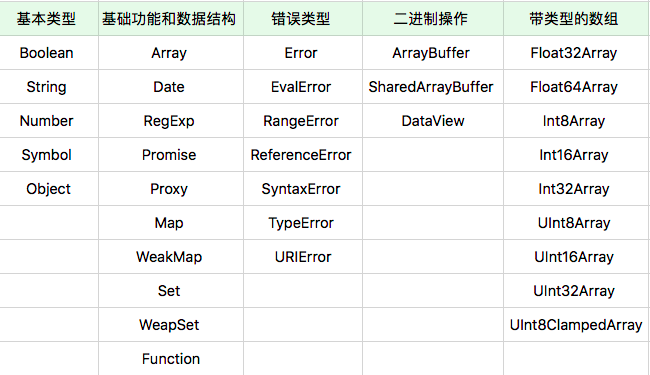

# 运行时

## 数据结构

### 类型

- Undefined

  只有一个值，那就是 undefined。在老的浏览器中，由于 JavaScript 的设计缺陷，undefined 不是一个关键字，也就是说 undefined 可以被覆盖。为了弥补这个缺陷，引入 void。void 是一种操作符，执行 void 之后的代码并返回 undefined。一般用于得到 undefined。  
  在新的浏览器中，可以直接使用 undefined。

  ```javascript
  void 0 == undefined; // true
  ```

  ```html
  <a href="javascript: void(0)">About</a>
  ```

- Null

  只有一个值，那就是 null。

- Boolean

  只有两个值，那就是 true/false。

- Number

  ```javascript
  new Number(value);
  var a = new Number("123"); // a === 123 is false。新建一个Number对象。
  var b = Number("123"); // b === 123 is true。新建一个Number类型。
  a instanceof Number; // is true
  b instanceof Number; // is false
  ```

- String

  JavaScript 中的字符串是永远无法变更的，一旦字符串构造出来，无法用任何方式改变字符串的内容，所以字符串具有值类型的特征。  
   string 的意义并非“字符串”，而是字符串的 UTF16 编码，我们字符串的操作 charAt、charCodeAt、length 等方法针对的都是 UTF16 编码。

- Symbol

  Symbol 是 ES6 中引入的新类型，它是一切非字符串的对象 key 的集合，在 ES6 规范中，整个对象系统被用 Symbol 重塑。

- Object

  对象的定义是“属性的集合”。属性分为数据属性和访问器属性，二者都是 key-value 结构，key 可以是字符串或者 Symbol 类型。事实上，JavaScript 中的“类”仅仅是运行时对象的一个私有属性，而 JavaScript 中是无法自定义类型的。

#### 类型转换



- StringToNumber
  - Number()
  - parseInt()
  - parseFloat()
- NumberToString
  - toString()
- 装箱与拆箱
  - 装箱
  - 拆箱
    - 对象到 String 和 Number 的转换都遵循“先拆箱再转换”的规则。通过拆箱转换，把对象变成基本类型，再从基本类型转换为对应的 String 对象 或者 Number 对象。

#### typeof instanceof Object.prototype.toString()

- typeof 用于知道变量属于哪种类型
  
- instanceof 用于判断是否是某个类的实例，涉及到原型链
- 在 JavaScript 中，没有任何方法可以更改私有的 Class 属性，因此 Object.prototype.toString 是可以准确识别对象对应的基本类型的方法，它比 instanceof 更加准确。

  ```javascript
  Object.prototype.toString.call([1, 2, 3]); //"[object Array]"
  Object.prototype.toString.call(new Date()); //"[object Date]"
  Object.prototype.toString.call(/a-z/); //"[object RegExp]"
  ```

_Use instanceof for custom types:_

```javascript
var ClassFirst = function() {};
var ClassSecond = function() {};
var instance = new ClassFirst();
typeof instance; // object
typeof instance == "ClassFirst"; // false
instance instanceof Object; // true
instance instanceof ClassFirst; // true
instance instanceof ClassSecond; // false
```

_Use typeof for simple built in types:_

```javascript
'example string' instanceof String; // false
typeof 'example string' == 'string'; // true

'example string' instanceof Object; // false
typeof 'example string' == 'object'; // false

true instanceof Boolean; // false
typeof true == 'boolean'; // true

99.99 instanceof Number; // false
typeof 99.99 == 'number'; // true

function() {} instanceof Function; // true
typeof function() {} == 'function'; // true
```

_Use instanceof for complex built in types:_

```javascript
/regularexpression/ instanceof RegExp; // true
typeof /regularexpression/; // object

[] instanceof Array; // true
typeof []; //object

{} instanceof Object; // true
typeof {}; // object
```

_And the last one is a little bit tricky:_

```javascript
typeof null; // object
```

#### 面向对象 VS 基于对象

对象的特点包括：

- 对象具有唯一标识性，一般来说是内存地址：即使完全相同的两个对象，也并非同一个对象。
- 对象有状态：对象具有状态，同一对象可能处于不同状态之下。
- 对象具有行为：即对象的状态，可能因为它的行为产生变迁。

JavaScript 中使用了原型来描述语言中的对象。Java/C++使用类来描述语言中的对象。在 JavaScript 中，状态和行为都用“属性”表示。JavaScript 也是面向对象的语言。

#### 数据属性 VS 访问器属性

为了更好得描述属性，引入了多种特征值。

- 数据属性
  - [[value]]：就是属性的值。
  - [[writable]]：决定属性能否被赋值。
  - [[enumerable]]：决定 for in 能否枚举该属性。
  - [[configurable]]：决定该属性能否被删除或者改变特征值。
- 访问器属性
  - [[getter]]：函数或 undefined，在取属性值时被调用。
  - [[setter]]：函数或 undefined，在设置属性值时被调用。
  - [[enumerable]]：决定 for in 能否枚举该属性。
  - [[configurable]]：决定该属性能否被删除或者改变特征值。

#### 原型

JavaScript 实现面向对象的方式是使用原型。

原型系统的“复制操作”有两种实现思路：

- 一个是并不真的去复制一个原型对象，而是使得新对象持有一个原型的引用；**JavaScript 选择了这种实现方式。**
- 另一个是切实地复制对象，从此两个对象再无关联。

原型系统的原理：

- 如果所有对象都有私有字段 [[\_\_proto\_\_]]，就是对象的原型；
- 读一个属性，如果对象本身没有，则会继续访问对象的原型，直到原型为空或者找到为止。

操纵原型的方法：

- Object.create 根据指定的原型创建新对象，原型可以是 null；
- Object.getPrototypeOf 获得一个对象的原型；
- Object.setPrototypeOf 设置一个对象的原型。

##### [[prototype]] VS \_\_proto\_\_


\_\_proto\_\_ is the actual object that is used in the lookup chain to resolve methods, etc. [[prototype]] is the object that is used to build \_\_proto\_\_ when you create an object with new。[[prototype]]是对象的私有字段。
可以简单得理解为,Foo.[[prototype]]是原型对象，\_\_proto\_\_指向原型对象。

##### new

```javascript
function Foo() {
  // ...
}

var a = new Foo();
// var a = new Foo; // new后面可有可无()，最好使用有()的写法。

Object.getPrototypeOf(a) === Foo.prototype; // true
a.__proto__ == Foo.prototype; // true
```

`new 构造器` 和 [[prototype]] 一起理解，new 主要用于新建一个对象，新对象的[[\_\_proto\_\_]]指向函数的[[prototype]]。当函数调用时前面加了 new，该函数成为构造器。

1. 以构造器的 [[prototype]] 属性为原型，创建新对象；
2. 以新对象为 this，将 this 和调用参数传给构造器，执行[[call]]；
3. 如果构造器[[call]]返回的是对象，则返回该对象。否则返回第一步创建的对象(也就是 this)。

#### ES6 class 关键字

ES6 来了之后，推荐使用 class 来构造类。

```javascript
class Animal {
  constructor(name) {
    this.name = name;
  }

  speak() {
    console.log(this.name + " makes a noise.");
  }
}

class Dog extends Animal {
  constructor(name) {
    super(name); // call the super class constructor and pass in the name parameter
  }

  speak() {
    console.log(this.name + " barks.");
  }
}

let d = new Dog("Mitzie");
d.speak(); // Mitzie barks.
```

#### 宿主对象

JavaScript 宿主提供的对象。如浏览器的 window，node 的 global。

#### 内置对象

JavaScript 语言提供的对象。

- 固有对象-由标准规定，随着 JavaScript 运行而自动创建的对象
- 原生对象-内置构造器可以创建的对象，如 Array 等。
  
  这些构造器，可以使用 new 运算创建新的对象。注意，这些对象无法被继承。
  函数对象的定义是具有 [[call]] 私有字段的对象。构造器对象的定义是具有私有字段 [[construct]] 的对象。我们可以这样说，任何对象只需要实现 [[call]]，它就是一个函数对象，可以去作为函数被调用。而如果它能实现 [[construct]]，它就是一个构造器对象，可以作为构造器被调用。用户用 function 关键词定义时，同时是函数对象和构造器对象。**ES6 之后，`()=>{}`箭头函数写法，只能作为函数对象，无法作为构造器对象。**
- 普通对象-由{}语法、Object 构造器或者 class 关键字定义类创建的对象，它能够被原型继承

#### 创建对象的方式

- new: `var a = new Object();`
- 字面量: `var a = {};`
- function: `var o = function(){};`
- DOM API: `var a = document.createElement('p');`
- 内置对象 API：

  ```javascript
  var e = Object.create(null);
  var f = Object.assign({ k1: 3, k2: 8 }, { k3: 9 });
  var g = JSON.parse("{}");
  ```

- 装箱：`var a = Object(true);`

### 实例

## 算法

### 事件循环-宏观任务与微观任务

在 ES3 和更早的版本中，JavaScript 没有异步执行代码的能力，宿主环境(node 或浏览器)传递给 JavaScript 引擎一段代码，引擎就执行，这个引擎执行的任务是宿主任务。(宏观任务)

在 ES5 之后，JavaScript 引入了 Promise，意味着引擎本身也可以发起任务。(微观任务)

JavaScript 引擎等待宿主环境分配宏观任务，也就是事件循环。可以大概理解为事件循环就是宏观任务的队列。事件循环是跑在独立线程中的循环，伪代码为

```javascript
while (TRUE) {
  r = wait();
  execute(r);
}
```

在宏观任务中，JavaScript 的 Promise 还会产生异步代码，JavaScript 必须保证这些异步代码在一个宏观任务中完成，因此，**每个宏观任务中又包含了一个微观任务队列。**

有了宏观任务和微观任务机制，我们就可以实现 JS 引擎级和宿主级的任务了，例如：Promise 永远在宏观任务队列尾部添加微观任务，所以微观任务始终在下一个宏观任务之前执行。setTimeout 等宿主 API，则会添加宏观任务。

异步执行的顺序为：

1. 分析有多少宏观任务
2. 分析每个宏观任务中的微观任务
3. 根据调用次序，确定宏观任务中的围观任务执行次序
4. 根据宏观任务的触发规则和调用次序，确定宏观任务的执行次序
5. 确定整个执行顺序

```javascript
function sleep(duration) {
  return new Promise(function(resolve, reject) {
    console.log("b");
    setTimeout(resolve, duration);
  });
}
console.log("a");
sleep(5000).then(() => console.log("c"));
```

上面的代码被`setTimeout`分为两个宏观任务：
宏观任务 1:

1. 先定义了 sleep 函数
2. 执行`console.log("a");`
3. 执行`sleep(5000)`，进入 sleep 函数
4. 执行`console.log("b");`之后，碰到`setTimeout`函数，开始下一个宏观任务

宏观任务 2:

1. 执行`resolve`
2. 执行`then`中的语句

#### async/await

ES2016 在 Promise 的基础上引入了`async/await`，有效得改变了代码结构。

在函数前加 async 表示这个函数总是返回一个 Promise。

await 只能用在 async 的函数中，表示等待 await 之后的函数返回结果之后，执行剩下的语句。

```javascript
function sleep(duration) {
  return new Promise(function(resolve, reject) {
    setTimeout(resolve, duration);
  });
}

async function foo() {
  console.log("a");
  await sleep(2000);
  console.log("b");
}
foo();
console.log("hello");
/*
a
hello
b
*/
```

上面的代码理解为：

1. 定义 sleep 和 foo 函数。其中，foo 是异步执行函数。
2. 宏观任务 1 中
   1. 执行`foo()`
   2. 执行`console.log("a");`
   3. 执行`sleep`，碰到`setTimeout`,之后的任务在下一个宏观任务中执行
   4. 由于`sleep`前有`await`，`foo`中剩余的`console.log("b");`在下一个宏观任务中执行
   5. 跳出`foo`，执行`console.log("hello");`
3. 宏观任务 2 中
   1. 执行`resolve`
   2. 执行`console.log("b");`

如果异步函数前无`await`，请看下面的例子

```javascript
function sleep(duration) {
  return new Promise(function(resolve, reject) {
    setTimeout(resolve, duration);
  });
}

async function foo() {
  console.log("a");
  sleep(2000);
  console.log("b");
}
foo();
console.log("hello");
/*
a
b
hello
*/
```

上面的代码理解为：

1. 定义 sleep 和 foo 函数。其中，foo 是异步执行函数。
2. 宏观任务 1 中
   1. 执行`foo()`
   2. 执行`console.log("a");`
   3. 执行`sleep`，碰到`setTimeout`,之后的任务在下一个宏观任务中执行
   4. 由于`sleep`前没有`await`，继续执行`console.log("b");`
   5. 跳出`foo`，执行`console.log("hello");`
3. 宏观任务 2 中
   1. 执行`resolve`

### 函数的执行

#### 闭包

闭包是绑定了执行环境的函数。包含:

1. 环境部分
   1. 环境: 函数的词法环境(执行上下文的一部分)
   2. 标识符列表: 函数中用到的未声明的变量
2. 表达式部分: 函数体

##### 执行上下文

执行上下文在 ES3 中，包含三个部分:

- scope：作用域，也常常被叫做作用域链。
- variable object：变量对象，用于存储变量的对象。
- this value：this 值。

在 ES5 中，我们改进了命名方式，把执行上下文最初的三个部分改为下面这个样子:

- lexical environment：词法环境，当获取变量时使用。
- variable environment：变量环境，当声明变量时使用。
- this value：this 值。

在 ES2018 中，扩展为:

- lexical environment：词法环境，当获取变量或者 this 值时使用。
- variable environment：变量环境，当声明变量时使用。
- code evaluation state：用于恢复代码执行位置。
- Function：执行的任务是函数时使用，表示正在被执行的函数。
- ScriptOrModule：执行的任务是脚本或者模块时使用，表示正在被执行的代码。
- Realm：使用的基础库和内置对象实例。
- Generator：仅生成器上下文有这个属性，表示当前生成器。

### 语句级的执行
