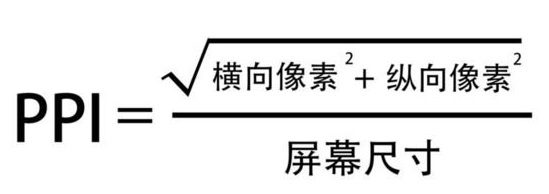

# 常用短笔记

## 切换多种 NPM 版本

使用`nvm list`

## 查看全局 npm 包

使用`npm list -g --depth=0`

## 设计 API

### 构建数据模型设计

使用`docson`来构建数据模型并可视化。使用方法：

1. 下载`docson`源码
2. 使用`docson -d ./examples`开启服务，打开自己构建的模型文件夹
3. 各方参与人员可以在线查看

### API 接口的设计

使用`swagger editor`。使用方法：

1. 下载`swagger editor`源码
2. 执行`npm start`。注意，node 版本需要为 6.x

## 查询 CSS 是否适用于某个浏览器版本

[CanIUse](https://caniuse.com/#search=user-select)

## BootStrap 检测工具，检测有没有正确使用 BootStrap

[BootLint](https://github.com/twbs/bootlint)

## 分辨率/尺寸/像素密度

### 屏幕

手机配置：

- 主屏尺寸：5.2 inch
  物理尺寸
- 主屏分辨率：1920\*1080 像素
  屏幕上的总像素个数
- 屏幕像素密度：424ppi
  

[参考链接](https://www.jianshu.com/p/c3387bcc4f6e)

### 图片

通过修改图片的 dpi(与 ppi 类似) 可以更改图片的尺寸，因为图片的分辨率是不会变化的。
[参考链接](http://www.sohu.com/a/139247123_409010)

## VSCODE 配置

使用 Setting Sync 插件同步 VSCODE 的各个插件。

- GitHub Token: **\***f8d7f89d6e67d6a2fefb39d30e1f79a1ff17c9c3**\*\***
- GitHub Gist: **\***d54bacfef33d7af262c8df43db3078df**\*\***
- GitHub Gist Type: Secret

## VSCODE 快捷键

快速生成 html5：`! + Tab + Tab`

## AEM 开发

### Eclipse 代码与 AEM 的同步

Eclipse 中，AEM 视图，

- Server 点击 Publish，将 Eclipse 代码部署到 AEM（也可以使用 Maven，语句为`mvn -PautoInstallPackage -Padobe-public clean install`）
- 代码目录上，点击 import from AEM，将在 AEM 进行的操作同步回 Eclipse 中
