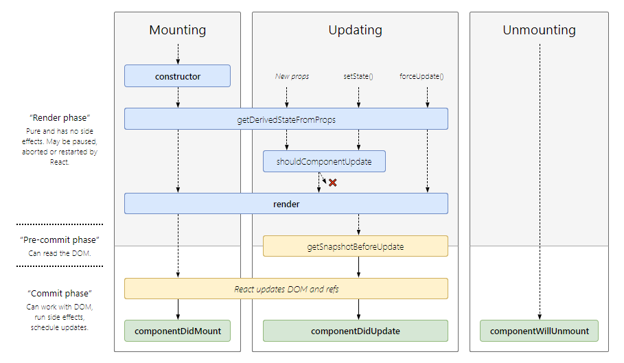
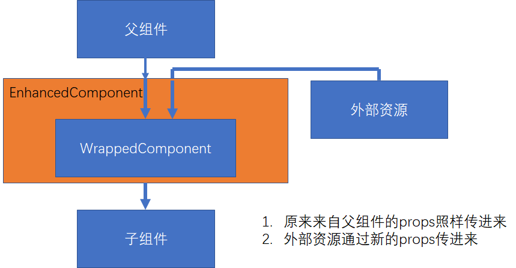

# React 及其生态

## 出现背景及特性

传统的前端开发中，使用 jQuery 进行 UI 的开发。但是，传统的前端开发面临了两个大问题：

1. UI 操作关注了大量细节。jQuery 的 API 众多，直接对 DOM 进行操作，很容易让开发者陷入细节而混淆了总体设计。
2. 应用程序的状态分散的各处，无法追踪和维护。

Facebook 为了解决了两个问题，开发出了 React。React 其实就是一个 View 层，引入了：

1. 1 个新概念： 组件
2. 4 个主要 API:
3. 单向数据流: 引入 Flux 设计方式，简化状态管理
4. 完善的错误提示

## 组件方式构建 UI

组件主要由 `props` 和 `state` 组成 `view`，可以理解为一个纯函数。`props` 是由上层组件(使用者)传递给下层组件的，下层组件不能修改上层组件传给它的`props`，这叫做组件间的单向数据流(注意，Flux 单向数据流指的是整个 React 应用的数据流)。

组件设计时，遵循的原则有：

1. 让组件无自身 `state`，所需数据从 `props` 获取
2. DRY 原则
3. 单一职责原则

### 受控组件（推荐使用） VS 非受控组件

form 表单相关的元素比较特殊，在 React 中由两种设计思路：

1. 受控组件  
   受控组件的表单元素由使用者维护。

   ```javascript
   // 受控组件<input />
   class NameForm extends React.Component {
     constructor(props) {
       super(props);
       this.state = { value: "" };

       this.handleChange = this.handleChange.bind(this);
       this.handleSubmit = this.handleSubmit.bind(this);
     }

     handleChange(event) {
       this.setState({ value: event.target.value });
     }

     handleSubmit(event) {
       alert("A name was submitted: " + this.state.value);
       event.preventDefault();
     }

     render() {
       return (
         <form onSubmit={this.handleSubmit}>
           <label>
             Name:
             <input
               type="text"
               value={this.state.value}
               onChange={this.handleChange}
             />
           </label>
           <input type="submit" value="Submit" />
         </form>
       );
     }
   }
   ```

2. 非受控组件  
   非受控组件的表单元素由 DOM 维护。

   ```javascript
   // 非受控组件<input />
   class NameForm extends React.Component {
     constructor(props) {
       super(props);
       this.handleSubmit = this.handleSubmit.bind(this);
     }

     handleSubmit(event) {
       alert("A name was submitted: " + this.input.value);
       event.preventDefault();
     }

     render() {
       return (
         <form onSubmit={this.handleSubmit}>
           <label>
             Name:
             <input type="text" ref={input => (this.input = input)} />
           </label>
           <input type="submit" value="Submit" />
         </form>
       );
     }
   }
   ```

## JSX

JSX 不是模板语言，是 JavaScript + XML，可以在 JavaScript 中直接写 HTML 标记 ，可以看作是一种语法糖，通过 Babel 将 JSX 转化为 ES5 的 javascript 代码， 改变 DOM。

JSX 的语法主要是使用标签元素，如果里面要使用 JavaScript，则在 `{}` 里写 JavaScript 代码。

1. JSX 本身也是表达式  
   `const element = <h1>Hello, wWrld!</h1>`
2. 在属性中使用表达式  
   `<MyComponent foo={1 + 2 + 3} />`
3. 延展属性

   ```javascript
   const props = { firstName: "frank", lastName: "hu" };
   const greeting = <Greeting {...props} />;
   ```

4. 表达式作为子元素  
   `const element = <li>{props.message}</li>`

在 JSX 中，小写的 tag 是原生节点，如：`<div>`；大写的 tag 是自定义的组件，如：`<Greeting />`。

### 在 HTML 中直接使用

引入脚本：

1. react
2. react-dom
3. babel

### 在脚手架生成的 app 中使用

用脚手架工具生成 app，然后使用 React 技术。

一般在写 Component 的时候，会使用 JSX 和 ES6 语法，然后使用 Babel 将这些代码转化为浏览器可识别的代码，之后用 Webpack 打包。

这也是 JSX 方式写 Component 一定要引用 react 模块的原因，因为 Babel 将 JSX 转化为 ES5 代码后，转化后代码中会有 React.createElement 等方法。

```javascript
// JSX 写法创建组件
const element = <h1 className="greeting">Hello, world!</h1>;

// Babel转化后，转化为 ES5
var element = React.createElement(
  "h1",
  { className: "greeting" },
  "Hello, world!"
);

// 运行后产生的 element 对象
const element = {
  type: "h1",
  props: {
    className: "greeting",
    children: "Hello, world!"
  }
};
```

## 生命周期



在理解生命周期 Updating 过程时，需要分清:

1. `nextProps` 和 `nextState`
2. `this.props` 和 `this.state`
3. `prevProps` 和 `prevState`

在 React 组件中，我们可以这么考虑。在现在这个时间，render 以 `this.state.color = "red"` 为基准渲染出了 View。
执行 `this.setState({color:"green"})` 会有如下步骤：

1. 执行 `shouldComponentUpdate(nextProps, nextState)`:  
   `this.state.color = "red"`  
   `nextState.color = "green"`
2. 执行 `render()`:  
   `this.state.color = "green"`
3. 执行 `componentDidUpdate(prevProps, prevState, snapshot)`:  
   `this.state.color = "green"`  
   `prevState.color = "red"`

### `constructor(props)`

主要用途有：

1. 用于初始化内部状态，很少使用。是唯一可以直接修改 `state` 的地方
2. 用于绑定组件事件中的 `this`

### `static getDerivedStateFromProps(props, state)`

1. 当 `state` 需要从 `props` 初始化时使用
2. 尽量不要使用。维护两者状态一致性会增加复杂度
3. 每次 render 都会调用
4. 典型场景：表单控件获取默认值

### `render()`

一个纯函数，根据 `this.props` 和 `this.state` 获取当前的 `view`。

### `componentDidMount()`

1. UI 渲染完成后调用
2. 只执行一次
3. 典型场景: 获取外部资源

### `shouldComponentUpdate(nextProps, nextState)`

如果组件在其他地方执行了`this.setState`，那么，会执行这个步骤里。在执行这个步骤的时候， `nextState` 是 `this.setState` 执行后新的 `state`，但此时， `this.state` 还是原来的，并没有更改。也就是说， `this.state` 是跟 `render()` 同步的，如果 `shouldComponentUpdate(nextProps, nextState)` 返回了 false， 则 `render()` 不执行， `this.state` 还是保留的原来的值。

1. 决定 Virtual DOM 是否要重绘
2. 一般可以由 PureComponent 自动实现
3. 典型场景:性能优化

### `getSnapshotBeforeUpdate(prevProps, prevState)`

1. 在页面渲染到 DOM 前调用， `this.state` 已更新
2. 典型场景: 获取渲染前的 DOM

### `componentDidUpdate(prevProps, prevState, snapshot)`

1. 每次 UI 更新时被调用
2. 典型场景: 页面需要根据 props 变化重新获取数据

### `componentWillUnmount()`

1. 组件移除时被调用
2. 典型场景: 资源释放

## Virtual DOM 和 key

React 引入了虚拟 DOM 的概念。虚拟 DOM 使用 diff 算法，根据广度优先原则，加快了真实 DOM 的渲染。

在进行 diff 算法运算时，比较虚拟 DOM 的改变：

- 如果当前层级，节点只是修改了前后关系，则根据 key 重新排列节点
- 如果当前层级，节点类型/节点数目进行了改变，则直接将变化了的节点删除，创建新的节点

## 组件复用 - 高阶组件 HOC

HOC 是包裹另一个 React 组件的 React 组件，它接受组件作为参数，返回一个新的组件。

```javascript
hocFactory:: (WrappedComponent: React.Component) => EnhancedComponent: React.Component
```



```javascript
// 定义一个高阶组件。在这个高阶组件中，time 是新传入进原来 WrappedComponent 的 props， {...this.props} 是原来就要传进 WrappedComponent 的 props
import React from "react";

export default function withTimer(WrappedComponent) {
  return class extends React.Component {
    state = { time: new Date() };
    componentDidMount() {
      this.timerID = setInterval(() => this.tick(), 1000);
    }

    componentWillUnmount() {
      clearInterval(this.timerID);
    }

    tick() {
      this.setState({
        time: new Date()
      });
    }
    render() {
      return <WrappedComponent time={this.state.time} {...this.props} />;
    }
  };
}
```

```javascript
// 得到一个EnhancedComponent
import React from "react";
import withTimer from "./withTimer";

class MessageList extends React.PureComponent {
  render() {
    return (
      <ul>
        {this.props.messages.map(msg => (
          <li>{msg}</li>
        ))}
      </ul>
    );
  }
}

export class ChatApp extends React.Component {
  state = {
    messages: [],
    inputMsg: ""
  };

  handleInput = evt => {
    this.setState({
      inputMsg: evt.target.value
    });
  };
  handleSend = () => {
    const text = this.state.inputMsg;
    if (text) {
      const newMessages = [...this.state.messages, text];
      this.setState({
        messages: newMessages,
        inputMsg: ""
      });
    }
  };
  render() {
    return (
      <div>
        <MessageList messages={this.state.messages} />
        <div>
          <input value={this.state.inputMsg} />
          <button onClick={this.handleSend}>Send</button>
        </div>
        <h2>{this.props.time.toLocaleString()}</h2>
      </div>
    );
  }
}

export default withTimer(ChatApp);
```

## 组件复用 - 函数作为子组件

```javascript
// 使用 children 属性，children 接收的是一个函数
class MyComponent extends React.Component {
  render() {
    return <div>{this.props.children("Scuba Steve")}</div>;
  }
}
MyComponent.propTypes = {
  children: React.PropTypes.func.isRequired
};

// 函数作为子组件使用
<MyComponent>{name => <div>{name}</div>}</MyComponent>;
```

## Context API

随着组件层级的递增，如果最下层的组件需要某个 props，但是该 props 来自最上层。为了使最下层获取该 props，我们会在各个中间层也传进去这个 props，中间层只是起到传递作用，不会对这个 props 进行更改。这样会使代码看起来很乱。 Context 提供了另外一种传递数据的方式。 Redux 就采用了这种方式。

```javascript
// 1. Context lets us pass a value deep into the component tree
// without explicitly threading it through every component.
// Create a context for the current theme (with "light" as the default).
const ThemeContext = React.createContext("light");

class App extends React.Component {
  render() {
    // 2. Use a Provider to pass the current theme to the tree below.
    // Any component can read it, no matter how deep it is.
    // In this example, we're passing "dark" as the current value.
    return (
      <ThemeContext.Provider value="dark">
        <Toolbar />
      </ThemeContext.Provider>
    );
  }
}

// A component in the middle doesn't have to
// pass the theme down explicitly anymore.
function Toolbar(props) {
  return (
    <div>
      <ThemedButton />
    </div>
  );
}

class ThemedButton extends React.Component {
  // 3. Assign a contextType to read the current theme context.
  // React will find the closest theme Provider above and use its value.
  // In this example, the current theme is "dark".
  static contextType = ThemeContext;
  render() {
    return <Button theme={this.context} />;
  }
}
```

## 脚手架

- Create-React-App:Facebook 自己出的，是学习 React 比较好用的 CLI，但是没有集成 Redux/React-Router
- Codesandbox：在线的一款快速构建 React 应用
- Rekit：一款在 CRA 基础上增加了 Redux 等功能的 CLI

## 打包和部署

打包的主要目的是将代码编译为浏览器可以识别的代码，同时也起到整合资源和优化代码体积的目的。

一般使用 Webpack 进行打包。在打包时，需要注意：

1. 环境变量的设置
2. 禁用开发时的代码，如 logger 等
3. 设置应用的根路径

## Redux

React 解决了组件状态与 DOM 的对应关系问题: `state + props => view`。

Redux 解决了整个应用的状态管理问题。Context API 提出了一种方案，可以不用层层传递 props 到最底层，而通过提供全局的 Context 来提供全局的数据状态。高阶组件也提出一种方式，通过封装，给组件提供额外的 props。Redux 整合了这个思路，通过引入`react-redux`，将 Redux 和 React 整合起来，相当于给 React 组件提供了一个全局可用的 Context，这个 Context 就是 Redux 的 Store。

Redux 相当于给应用中的所有 React 组件增加了一个全局的控制机制，用户通过这个机制控制 Store，所有订阅了 Store 的 React 组件根据 Redux Store State 来更新 DOM。

Redux 的三大特性：

1. 单一数据源，也就是说只有一个 Store
2. 可预测性，`state + action => new state`
3. 纯函数更新，也就是说更新 Store 只能通过 Reducer，Reducer 是纯函数


### 数据流向

1. store.dispatch(action)发起一个 action
2. store 调用 reducer，产生新的 state
3. store 保存新的 state
4. 由于 state 有了更新，执行 subscribe 中的监听函数

### Action

Action 是一个简单对象。当该对象被 Store dispatch 后， Reducers 会根据这个 Action 更新 Store 中的 state。

Action 需要定义 type 属性。

```javascript
{ type: 'ADD_TODO', text: 'Go to swimming pool' }
```

#### Action Creators

顾名思义，是产生 Action 的函数。

```javascript
function addTodo(text) {
  return {
    type: ADD_TODO,
    text
  };
}
```

#### bindActionCreators

产生 Action 后，要将此 Action Dispatch 出去 Reducer 才会去处理该 Action 从而更新 Store 中的 state。为了简便处理产生 Action 和 Dispatch，Redux 提供了 bindActionCreators 来简化这一步骤。bindActionCreators 表示将 Action Creators 产生的 Action Dispatch 出去。

### Reducer

Reducer 是一个纯净函数，输入为旧的 state 和 Action\_，输出为新的 state。

```javascript
function todoApp(state = initialState, action) {
  switch (action.type) {
    case SET_VISIBILITY_FILTER:
      return Object.assign({}, state, {
        visibilityFilter: action.filter
      });
    case ADD_TODO:
      return Object.assign({}, state, {
        todos: [
          ...state.todos,
          {
            text: action.text,
            completed: false
          }
        ]
      });
    default:
      return state;
  }
}
```

上面的代码中，多个 action.type 混在一起，会造成代码混乱。实际应用中，会将多个 Reducer 根据 type 进行拆分,然后在总的 Reducer 中进行组装。

拆分成多个 Reducers：

```javascript
function todos(state = [], action) {
  switch (action.type) {
    case ADD_TODO:
      return [
        ...state,
        {
          text: action.text,
          completed: false
        }
      ]
    default:
      return state
  }
}
​
function visibilityFilter(state = SHOW_ALL, action) {
  switch (action.type) {
    case SET_VISIBILITY_FILTER:
      return action.filter
    default:
      return state
  }
}
```

将多个 Reducers 统一管理：

```javascript
function todoApp(state = {}, action) {
  return {
    visibilityFilter: visibilityFilter(state.visibilityFilter, action),
    todos: todos(state.todos, action)
  };
}
```

#### combineReducers

Redux 提供了一个 combineReducers 来统领所有 Reducer 。功能与上面代码中的 todoApp 类似。

```javascript
import { combineReducers } from 'redux'
​
const todoApp = combineReducers({
  visibilityFilter,
  todos
})
​
export default todoApp
```

### Store

Store 是存放整个应用状态的地方。

创建方法：

```javascript
import { createStore } from "redux";
import todoApp from "./reducers";
const store = createStore(todoApp);
```

常用方法有：

1. `getState()`: 获取当前 state
2. `dispatch(action)`: 发出一个 action。 Store 自动调用 reducer 更新 state。
3. `subscribe(listener)`:当 state 有更改后，会执行回调函数
4. unsubscribe listener: 通过 `const listener1 = subscribe(listener); listener1();` 实现。

Store 中的 state 的形式为：

```javascript
{
  todos: [{
    text: 'Eat food',
    completed: true
  }, {
    text: 'Exercise',
    completed: false
  }],
  visibilityFilter: 'SHOW_COMPLETED'
}
```

## Redux 与 React 的结合使用

Redux 是不一定要和 React 绑定使用的，它只是状态管理工具。如果需要将 Redux 和 React 结合使用，需要引入 `react-redux` 包。

在 React 中使用 Redux，需要将 React 组件分为展示组件和容器组件。展示组件只负责展示，容器组件负责与 Redux 通信。

Redux 与 React 的结合，主要使用了 Context API 和高阶组件。Context API 提供了全局可用的 Store，高阶组件`connect()(wrappedComponent)`实现了给 WrappedComponent 传递额外 props 的能力。

connect 实现高阶组件：

```javascript
import React from "react";
import { connect } from "react-redux";
import { addTodo } from "../actions";

let AddTodo = ({ dispatch }) => {
  let input;

  return (
    <div>
      <form
        onSubmit={e => {
          e.preventDefault();
          if (!input.value.trim()) {
            return;
          }
          dispatch(addTodo(input.value));
          input.value = "";
        }}
      >
        <input
          ref={node => {
            input = node;
          }}
        />
        <button type="submit">Add Todo</button>
      </form>
    </div>
  );
};
AddTodo = connect()(AddTodo);

export default AddTodo;
```

Provider 提供 Context：

```javascript
import React from "react";
import { render } from "react-dom";
import { Provider } from "react-redux";
import { createStore } from "redux";
import todoApp from "./reducers";
import App from "./components/App";

const store = createStore(todoApp);

render(
  <Provider store={store}>
    <App />
  </Provider>,
  document.getElementById("root")
);
```
