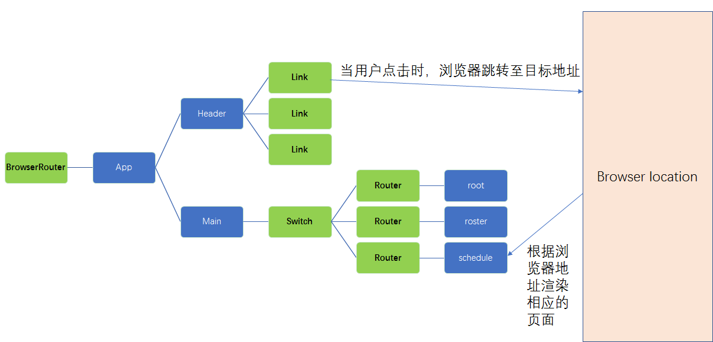

# React Router v4 Tutorial

一般我们要引入的包是 react-router-dom

## 基本原理



## BrowserRouter

在 App 外面嵌套一层 BrowserRouter

```javascript
ReactDOM.render(
  <BrowserRouter>
    <App />
  </BrowserRouter>,
  document.getElementById("index")
);
```

## Link

使用 Link 使浏览器路径跳转到希望的路径。

```javascript
<ul>
  <li>
    <Link to="/">Home</Link>
  </li>
  <li>
    <Link to="/roster">Roster</Link>
  </li>
  <li>
    <Link to="/schedule">Schedule</Link>
  </li>
</ul>
```

## Switch & Route

在 Router 中加入 Switch 和 Route，使页面根据浏览器路径渲染合适的页面。

```javascript
<Switch>
  <Route exact path="/" render={() => <div>root</div>} />
  <Route path="/roster" render={() => <div>roster</div>} />
  <Route path="/schedule" render={() => <div>schedule</div>} />
</Switch>
```

## 解决刷新问题

在如上的代码中，如果浏览器定位至 http://localhost:8080/roster ,然后刷新，会发现报错。解决这个问题的方法是在 webpack 配置中增加 webpackdevserver 的配置：

```javascript
//webpack.config.js
devServer: {
  historyApiFallback: true;
}
```

[点击此处获得源码](https://github.com/juventusfc/react-router-guide)
