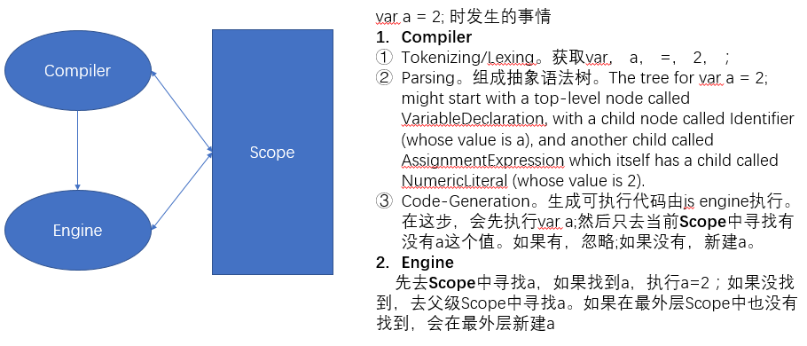
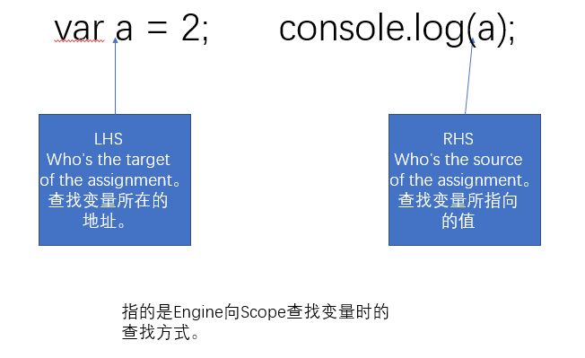

# 作用域

作用域是一套定义存储变量和查找变量的规则。

## 编译和执行时发生的事

当执行 `var a = 2;` 时，发生了什么呢？

Compiler 进行编译，询问 Scope 是否有 a 的值，如果没有，在 Scope 中新建 a。Compiler 编译完后，由 Engine 进行执行。在执行过程中，Engine 询问 Scope 是否有 a 。如果没有，去上一层查找。


Tips: 上图中，Compile 和 Scope 其实都是 Engine 的一部分。Engine 统管 JavaScript 的编译和执行。

### LHS && RHS

在 Engine 询问 Scope 时，会涉及查找问题。分为两种查找方式：
LHS(left-hand side) 寻找变量容器本身，RHS(righte-hand side) 寻找变量容器中的值。如 `var a = 2`，变量容器是 a，2 是其中的值。

不成功的 RHS 引用会导致抛出 ReferenceError 异常。不成功的 LHS 引用会导致自动隐式
地创建一个全局变量（非严格模式下），该变量使用 LHS 引用的目标作为标识符，或者抛
出 ReferenceError 异常（严格模式下）。

比如，在执行 `console.log(a)` 没找到 a，会报 ReferenceError。如果 RHS 找到了，但执行了值不具备的方法或属性，报 TypeError。


## 词法作用域

JavaScript 的作用域类型是 Lexical Scope(词法作用域)，有些语言的 Scope 类型是 Dynamic Scope。顾名思义，词法作用域就是指在 Compiler 执行时，变量所处的范围。一般来说，词法作用域就是指**代码书写时所处的代码块**。

### 词法作用域规则

```javascript
var a = 10086;
function foo(a) {
  console.log(a + b);
  console.log(a);
}
var b = 2;
foo(2);
/*
output:
4
2
*/
```

Engine 在执行 JavaScript 代码时，会优先去当前运行时所处的词法作用域中去查找变量。本例中，存在两个作用域，即全局作用域和 foo 作用域。执行 `console.log( a + b );` 时，优先去 foo 作用域中查找 b，没找到 b，继续去全局作用域查找 b。当找到 b 后，执行下一行代码`console.log(a);` 时，还是会先切换回 foo 作用域去查找。

### 作用域欺骗

有 `eval` 和 `with` 两种方式。但由于这两种是执行时才会确定代码，所以会**有性能问题**。尽量避免使用。

- eval

  `eval(str)` 中的 str 就像在编码时就在那一样，相当于 `var b = 3;` 入侵到 foo 的作用域中。

  ```javascript
  function foo(str, a) {
    eval(str); // cheating!
    console.log(a, b);
  }
  var b = 2;
  foo("var b = 3;", 1); // 1 3
  ```

- with

  `with(obj){ }`相当于在 obj 对象上修改属性值。

  ```javascript
  var obj = {
    a: 1,
    b: 2,
    c: 3
  };

  // more "tedious" to repeat "obj"
  obj.a = 2;
  obj.b = 3;
  obj.c = 4;

  // "easier" short-hand
  with (obj) {
    a = 3;
    b = 4;
    c = 5;
  }
  ```

  如果新增了属性，会泄漏到全局，造成全局污染。

```javascript
function foo(obj) {
  with (obj) {
    a = 2;
  }
}
var o1 = {
  a: 3
};
var o2 = {
  b: 3
};
foo(o1);
console.log(o1.a); // 2
foo(o2);
console.log(o2.a); // undefined
console.log(a); // 2——不好，a 被泄漏到全局作用域上了！
```

上面的代码在执行`foo(o2);`时，在 o2 作用域上找不到 a 属性，去上一层 foo 作用域也找不到，最后会去全局作用域上查找，但是也没找到。那么，由于是非严格模式，会在全局作用域上新建 a，并赋值 2。

### 函数作用域

函数作用域指每声明一个函数，会创造自身的作用域。函数执行时，Engine 会优先在这个函数对应的函数作用域中去查找/赋值变量。

#### 函数声明 declaration

`function foo(){..}` 在全局定义了 foo

```javascript
var a = 2;
function foo() {
  var a = 3;
  console.log(a); // 3
}
foo();
console.log(a); // 2
```

**注意**：上述代码会在 global 上定义 foo，造成全局污染。可以使用 IIFE，避免函数名的全局污染.

#### 函数表达式 expression

`(function foo(){..})` 或 `(function(){..})` 不会在全局定义 foo

```javascript
var a = 2;
//foo 只在()里能调用，在 global scope 中不存在
(function foo() {
  var a = 3;
  console.log(a); // 3
})(); //IIFE 立即执行函数表达式
console.log(a); // 2
```

##### 回调函数表达式

在定义 `回调函数表达式` 时，最好将匿名函数加上函数名称，便于 debug 时查看 Stack。

```javascript
setTimeout(function timeoutHandler() {
  console.log("I waited 1 second!");
}, 1000);
```

##### IIFE

IIFE 是立即执行函数表达式

1. 解决了变量全局污染及显式调用函数名的问题

   ```javascript
   var a = 2;
   (function IIFE(global) {
     var a = 3;
     console.log(a); // 3
     console.log(global.a); // 2
   })(window);
   console.log(a); // 2
   ```

2. 解决了 undefined 被错误覆盖的问题

   ```javascript
   undefined = true; // 给其他代码挖了一个大坑！绝对不要这样做！
   (function IIFE(undefined) {
     var a;
     if (a === undefined) {
       console.log("Undefined is safe here!");
     }
   })();
   ```

3. 适用于倒置代码

   ```javascript
   var a = 2;
   (function IIFE(def) {
     def(window);
   })(function def(global) {
     var a = 3;
     console.log(a); // 3
     console.log(global.a); // 2
   });
   ```

### 块作用域

JavaScript 表面上没有块的概念，如：

```javascript
for (var i = 0; i < 10; i++) {
  console.log(i);
}
```

i 并不是只在 for{..}中，它在定义在全局作用域中。

为了避免无谓的全局变量定义，可以使用以下方法在块里定义变量：

- `with`
- `try{ }catch(){ }` 中在 catch 中定义的变量只能在 catch 块{}中访问
- `let` 在{}中用 let 定义的变量，只能在该{}中访问
- `const` 在{}中用 const 定义的变量，只能在该{}中访问

## Hoisting 变量提升

每个作用域里所有的声明都会提升到这个作用域中其他代码执行之前。

1. 只有声明会提升，赋值不提升。进一步来说，对于函数，函数声明会提升，但是，函数表达式不提升。
2. 先提升函数后提升变量。

```javascript
console.log(a);
var a = 2;
// undefined
```

如上原因是：变量和函数声明先由 Compiler 读取，然后由 Engine 执行代码。在这里,

1. 将 `var a = 2` 拆成 `var a;` 和 `a =2;`
2. Compiler
   1. 先执行 `var a;`
   2. 然后执行 `console.log( a );`
   3. 之后执行 `a=2;`
