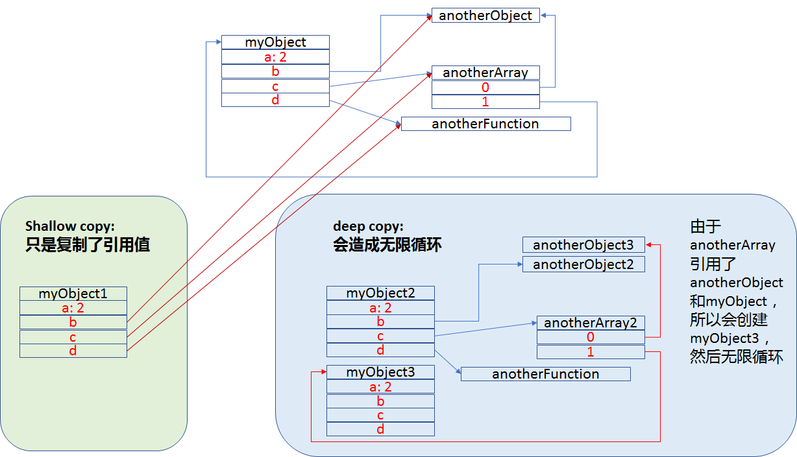
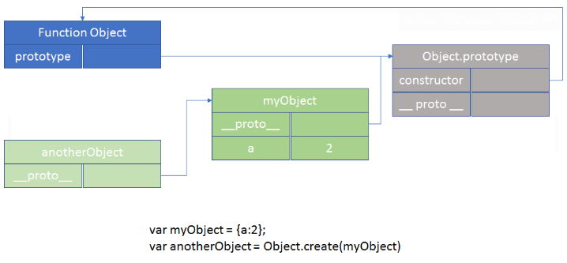

# Object详解

## Object 定义

```javascript
// 字面量
var myObj = {
  key: value
  // ...
};
// 构造函数
var myObj = new Object();
myObj.key = value;
```

## 6 种值类型

* 简单类型 5 种(typeof 返回值为 5 种中的 1 种)
  > `string`  
  > `number`  
  > `boolean`  
  > `null`  
  > `undefined`
* 复杂类型 1 种。object (typeof 返回值为 object)
  > `String`  
  > `Number`  
  > `Boolean`  
  > `Object`  
  > `Function`  
  > `Array`  
  > `Date`  
  > `RegExp`  
  > `Error`

注意：使用 xx instanceof yy（yy 代表某种 object 类型,如 String、Number 等）返回 true/false

```javascript
var strPrimitive = "I am a string";
typeof strPrimitive; // "string"
strPrimitive instanceof String; // false

var strObject = new String("I am a string");
typeof strObject; // "object"
strObject instanceof String; // true
```

## 获取对象的属性值

在对象中，属性都是简单的 string 类型。使用 . 或 [ ]获取属性对应的值。

```javascript
var myObject = {
  a: 2
};

myObject.a; // 2

myObject["a"]; // 2
```

## 复制对象

```javascript
function anotherFunction() {
  /*..*/
}

var anotherObject = {
  c: true
};

var anotherArray = [];

var myObject = {
  a: 2,
  b: anotherObject, // reference, not a copy!
  c: anotherArray, // another reference!
  d: anotherFunction
};

anotherArray.push(anotherObject, myObject);
```



### 浅复制和深复制

请参考[Closure vs. Object](/FP/05.md)

## 属性说明符

```javascript
var myObject = {
  a: 2
};

Object.getOwnPropertyDescriptor(myObject, "a"); // 得到a属性
/* {
   value: 2,
   writable: true,
   enumerable: true,
   configurable: true
  }*/

Object.defineProperty(myObject, "b", {
  // 设置b属性
  value: 2,
  writable: true,
  configurable: true,
  enumerable: true
});

myObject.b; // 2
```

## Getters & Setters

* 当执行`myObject.a`时，实际执行的是 get 方法。
* 当执行`myObject.a = 2`时，实际执行的是 get/set 方法。

```javascript
var myObject = {
  // define a getter for `a`
  get a() {
    return 2;
  }
};

Object.defineProperty(myObject, "b", {
  get: function() {
    return this.a * 2;
  },
  enumerable: true
});

myObject.a; // 2

myObject.b; // 4

var myObject = {
  // define a getter for `a`
  get a() {
    return this._a_;
  },

  // define a setter for `a`
  set a(val) {
    this._a_ = val * 2;
  }
};

myObject.a = 2;

myObject.a; // 4
```

## 判断属性存在与否&枚举

### 判断属性是来自原型链还是自身对象

```javascript
var myObject = {
  a: 2
};

"a" in myObject; // true
"b" in myObject; // false

myObject.hasOwnProperty("a"); // true
myObject.hasOwnProperty("b"); // false
```

### 枚举

```javascript
var myObject = {};

Object.defineProperty(
  myObject,
  "a",
  // make `a` enumerable, as normal
  { enumerable: true, value: 2 }
);

Object.defineProperty(
  myObject,
  "b",
  // make `b` non-enumerable
  { enumerable: false, value: 3 }
);

myObject.propertyIsEnumerable("a"); // true
myObject.propertyIsEnumerable("b"); // false

Object.keys(myObject); // a。得到能枚举的属性
Object.getOwnPropertyNames(myObject); // a b。得到所有属性
```

### 总结

| 寻找方式          | 获取对象所有可枚举属性                                      | 判断属性是否存在            |
| ----------------- | ----------------------------------------------------------- | --------------------------- |
| 当前对象 + 原型链 | `for k in myObj`                                            | `"a" in myObj`              |
| 当前对象          | `Object.keys(myObj)` 或 `Object.getOwnPropertyNames(myObj)` | `myObj.hasOwnProperty("a")` |

## 获取数组中的值

### for 循环

```javascript
var myArray = [1, 2, 3];

for (var i = 0; i < myArray.length; i++) {
  console.log(myArray[i]);
}
// 1 2 3
```

### ES5: 自带方法

```javascript
forEach(..), every(..), and some(..).
```

### ES6: for ... of ... 使用了 generator 机制

注：该部分会在 Generator 部分详解。

```javascript
var myArray = [1, 2, 3];

for (var v of myArray) {
  console.log(v);
}
// 1
// 2
// 3

var myArray = [1, 2, 3];
var it = myArray[Symbol.iterator]();

it.next(); // { value:1, done:false }
it.next(); // { value:2, done:false }
it.next(); // { value:3, done:false }
it.next(); // { done:true }
```

## class 在不同语言含义不同

* Java 等语言的面向对象编程中的 class。class 只定义了造房子的蓝图，具体房子需要通过 `new constructor()` 来创建 class 的实例。

  > `封装`  
  > `多态`  
  > `继承`:定义子类 class 时，复制父类 class 的属性及方法。

```java
class CoolGuy {
	specialTrick = nothing

	CoolGuy( trick ) {
		specialTrick = trick
	}

	showOff() {
		output( "Here's my trick: ", specialTrick )
	}
}

Joe = new CoolGuy( "jumping rope" )
Joe.showOff() // Here's my trick: jumping rope
```

* JS 中的 class。其实 JS 中没有 class 的概念，到 ES6 才引入了这个关键词，但背后原理与 Java 的 class 千差万别。“子类”link 到“父类”。

### class 只是 JS 中的语法糖

class 只是 function 的另一种语法糖。

```javascript
class F {
  constructor(name) {
    this.name = name;
  }
}
```

等价于

```javascript
"use strict";

function _classCallCheck(instance, Constructor) {
  if (!(instance instanceof Constructor)) {
    throw new TypeError("Cannot call a class as a function");
  }
}

var F = function F(name) {
  _classCallCheck(this, F);

  this.name = name;
};
```

### JS 模拟 Java 的实现方式(实际中用不到，JS 中用原型链，用 link)

由上可知，JS 中各个对象都是 link 在一起的。而 Java 中，子类复制父类的属性与方法。可以使用 Mixins 来模拟 Java 中 class 的复制方法。

#### 显式 Mixins

```javascript
// vastly simplified `mixin(..)` example:
function mixin(sourceObj, targetObj) {
  for (var key in sourceObj) {
    // only copy if not already present
    if (!(key in targetObj)) {
      targetObj[key] = sourceObj[key];
    }
  }

  return targetObj;
}
// 定义父类
var Vehicle = {
  engines: 1,

  ignition: function() {
    console.log("Turning on my engine.");
  },

  drive: function() {
    this.ignition();
    console.log("Steering and moving forward!");
  }
};
// 定义子类
var Car = mixin(Vehicle, {
  wheels: 4,

  drive: function() {
    Vehicle.drive.call(this);
    console.log("Rolling on all " + this.wheels + " wheels!");
  }
});
```

#### 隐式 Mixins

```javascript
// 定义父类
var Something = {
  cool: function() {
    this.greeting = "Hello World";
    this.count = this.count ? this.count + 1 : 1;
  }
};

Something.cool();
Something.greeting; // "Hello World"
Something.count; // 1
// 定义子类
var Another = {
  cool: function() {
    // implicit mixin of `Something` to `Another`
    Something.cool.call(this);
  }
};

Another.cool();
Another.greeting; // "Hello World"
Another.count; // 1 (not shared state with `Something`)
```

## [[Prototype]]

### 原理


注：对象通过`__proto__`寻找原型链上的方法和属性。

### 建立 prototype 方式

#### create



#### new

```javascript
function Foo() {
  // ...
}

var a = new Foo();

Object.getPrototypeOf(a) === Foo.prototype; // true
```

`new 函数` 和 `prototype` 一起理解，new 主要用于新建一个对象，新对象的`__proto__`指向函数的`prototype`。当函数调用时前面加了 new，该函数成为构造函数。

```javascript
// 不用new,返回了一个在函数内部定义的o对象。
function Person() {
  const o = {
    name: "frank",
    sayHello: function() {
      console.log("hello");
    }
  };

  return o;
}
var person = Person();
// 用new。函数的返回值是undefined，然后由于有new的存在，会创建一个新对象。
function Person() {
  const o = {
    name: "frank",
    sayHello: function() {
      console.log("hello");
    }
  };
}
var p = new Person();
p.__proto__ === Person.prototype; // true
```

```javascript
function Foo() {
  console.log("hi");
}

var a = new Foo(); // a为Foo {}
var b = Foo(); // b = undefined
```

```javascript
function Foo(name) {
  this.name = name;
}

Foo.prototype.myName = function() {
  return this.name; // this指向调用点对象。
};

var a = new Foo("a"); // Foo {name: "a"}
var b = new Foo("b");

a.myName(); // "a"
b.myName(); // "b"
```

## OO 风格和 OLOO 风格

### OO 风格

```javascript
function Foo(who) {
  this.me = who;
}
Foo.prototype.identify = function() {
  return "I am " + this.me;
};

function Bar(who) {
  Foo.call(this, who);
}
Bar.prototype = Object.create(Foo.prototype);

Bar.prototype.speak = function() {
  alert("Hello, " + this.identify() + ".");
};

var b1 = new Bar("b1");
var b2 = new Bar("b2");

b1.speak();
b2.speak();
```

### OLOO 风格 以对象作为关联


```javascript
var Foo = {
  init: function(who) {
    this.me = who;
  },
  identify: function() {
    return "I am " + this.me;
  }
};

var Bar = Object.create(Foo);

Bar.speak = function() {
  alert("Hello, " + this.identify() + ".");
};

var b1 = Object.create(Bar);
b1.init("b1");
var b2 = Object.create(Bar);
b2.init("b2");

b1.speak();
b2.speak();
```
