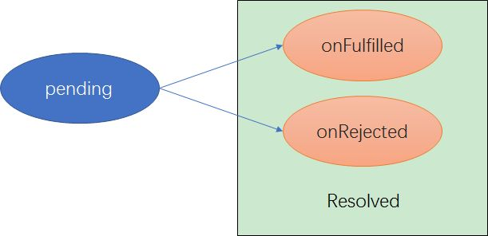

# Promise Chain

## promise 的状态变化



## 规范

```javascript
var rejectedPr = new Promise(function(resolve, reject) {
  // resolve this promise with a rejected promise
  resolve(Promise.reject("Oops")); //resolve()可能返回fulfilled或rejected
});

rejectedPr.then(
  function fulfilled() {
    // never gets here
  },
  function rejected(err) {
    console.log(err); // "Oops"
  }
);
```

## 详细执行过程

```javascript
// 具体执行过程请使用chrome调试查看 fetch是一种Promise
debugger;
let fetchResponse = fetch("https://api.github.com"); // Step 1
let jsonRes = fetchResponse // Step 2
  .then(
    (
      res // Step 3 紧跟着Step 2，无法被其他操作中断
    ) => res.json() // Step 6
  );
//显式return res.json()，
//jsonRes 成为一个fulfilled的promise，其中的值为res.json()
let result = jsonRes // Step 4
  .then(res => {
    // Step 5
    console.log(res); // Step 7
  });
//如果没有显式return，默认return undefined。
//之后，result成为一个fulfilled的promise，其中的值为undefined。
```

具体参见 [Promise.prototype.then()](https://developer.mozilla.org/en-US/docs/Web/JavaScript/Reference/Global_Objects/Promise/then)

再举一个例子：

```javascript
// step 1:
request("http://some.url.1/")
  // step 2:
  .then(function(response1) {
    foo.bar(); // undefined, error! 产生error,Step2返回rejected状态的promise

    // never gets here
    return request("http://some.url.2/?v=" + response1);
  })

  // step 3:
  .then(
    function fulfilled(response2) {
      // never gets here
    },
    // rejection handler to catch the error
    function rejected(err) {
      // step2产生的error在这里被handle
      console.log(err); // `TypeError` from `foo.bar()` error
      return 42; // Step3返回fulfill状态的promise，因此可以继续执行Step4
    }
  )

  // step 4:
  .then(function(msg) {
    console.log(msg); // 42
  });
```

## 常见写法

```javascript
debugger;
let p1 = new Promise(function(resolve, reject) {
  foo.bar();
  return resolve({ name: "frank" });
});
p2 = p1.then(
  onfilled => {
    return 0;
  },
  onrejected => {
    return 1;
  }
);
//执行完后，P1是rejected，P2是resolved。P2为resloved的原因是P1被onrejected函数捕获，返回了一个resloved的promise
```

```javascript
debugger;
let p1 = new Promise(function(resolve, reject) {
  foo.bar();
  return resolve({ name: "frank" });
});
p2 = p1.then(
  onfilled => {
    return 0;
  }
  // assumed rejection handler, if omitted or
  // any other non-function value passed
  // function(err) {
  //     throw err;
  // }
);
//执行完后，P1和P2都是rejected。P2为rejected的原因是默认的rejection handler会抛出捕获到的P1的rejected promise。同时，如果P2的rejected promise没有被其他捕获，会使系统报错
```

```javascript
debugger;
let p1 = new Promise(function(resolve, reject) {
  return resolve({ name: "frank" });
});
p2 = p1.then(
  // assumed fulfillment handler, if omitted or
  // any other non-function value passed
  // function(v) {
  //     return v;
  // }
  null,
  onrejected => {
    return 1;
  }
);
//执行完后，P1和P2都是resolved。从代码可知，P1和P2里的值是一样的{name: "frank"}。
//then(null,function(err){ .. })等价于catch(function(err){ .. })
```

## error handler

### 为什么需要 error handler

```javascript
var p = new Promise( function(resolve,reject){
	foo.bar();	// `foo` is not defined, so error!
	resolve( 42 );	// never gets here :(
} );
// 如上代码，在执行foo.bar()时，p的状态由pending转为rejected。
//同时，如果rejected状态的promise没有handler去handle，会报错。
VM1095:2 Uncaught (in promise) ReferenceError: foo is not defined
    at <anonymous>:2:2
    at new Promise (<anonymous>)
    at <anonymous>:1:9
```

### 捕捉无穷尽的 error

```javascript
var p = Promise.resolve(42); // Step1

p
  .then(
    // Step2
    function fulfilled(msg) {
      // numbers don't have string functions,
      // so will throw an error
      console.log(msg.toLowerCase());
    }
  )
  .catch(handleErrors);
//使用catch能解决step1和Step2产生的error，但是如果handleErrors 自身会产生error呢？暂时在ES6中没能解决这个问题。一些第三方Lib使用了done()来捕捉handleErrors产生的error。
```

## Promise Patterns

### Promise.all([ .. ])

每个 promise 都 fulfilled 后执行 then.如果 p1 或 p2 有一个 rejected 了，Promise.all( [p1,p2] )就返回一个 rejected 的 promise.

```javascript
var p1 = request("http://some.url.1/");
var p2 = request("http://some.url.2/");

Promise.all([p1, p2])
  .then(function(msgs) {
    // both `p1` and `p2` fulfill and pass in
    // their messages here
    return request("http://some.url.3/?v=" + msgs.join(","));
  })
  .then(function(msg) {
    console.log(msg);
  })
  .catch(errorHandler);
```

### Promise.race([ .. ])

P1 和 P2 竞争，谁先 resolved(fulfilled 或 rejected),Promise.race([ P1,P2 ])就是谁的状态.

不要在参数数组中传入空数组，由于设计上的缺陷，**Promise.race([ ])**会导致这个 Promise 永远无法 resolve.

```javascript
// `request(..)` is a Promise-aware Ajax utility,
// like we defined earlier in the chapter

var p1 = request("http://some.url.1/");
var p2 = request("http://some.url.2/");

Promise.race([p1, p2])
  .then(function(msg) {
    // either `p1` or `p2` will win the race
    return request("http://some.url.3/?v=" + msg);
  })
  .then(function(msg) {
    console.log(msg);
  })
  .catch(errorHandler);
```

### "Finally" will added to ES7+

用途：比如使用 Promise.race([ p1,p2 ])，p1 是一个 request，p2 是一个 timeout，当 p1 发起请求后，会对数据进行一些操作，但是这些操作 timeout 了，所以 timeout 后需要对那些数据进行还原，这就是 finally 要做的活。

```javascript
var p = Promise.resolve(42);

p
  .then(something)
  .finally(cleanup)
  .then(another)
  .finally(cleanup);
```

### 常用 API 举例

```javascript
var p1 = Promise.resolve(42);
var p2 = Promise.resolve("Hello World");
var p3 = Promise.reject("Oops");

Promise.race([p1, p2, p3]).then(function(msg) {
  console.log(msg); // 42
});

Promise.all([p1, p2, p3]).catch(function(err) {
  console.error(err); // "Oops"
});

Promise.all([p1, p2]).then(function(msgs) {
  console.log(msgs); // [42,"Hello World"]
});
```
