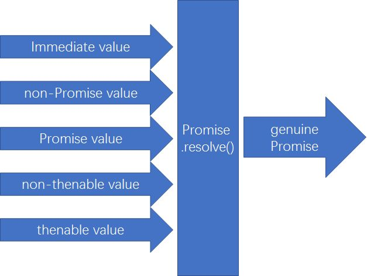

# Promises

## 定义

Promise 代表未来的值或事件的完成。Promise 状态确定后（onFulfilled 或 onRejected）就不会改变。

Promise 在规范上规定 Promise 只能使用异步调用方式 。不管是同步还是异步，回调都使用异步。即使 promise 是立即 fulfilled 或 rejected，then 里的 callback 也是异步执行的,会先去执行 console.log()方法。这种方法与 setTimeout(..,0)类似，表示将 then 里的 callback 放入 job queue。

```javascript
let fetchResponse = new Promise(function(resolve, reject) {
  return resolve({ name: "frank" }); // fetchResponse 马上resolved
}).then(res => {
  console.log("second"); // then里的callback异步执行，先放入event loop的job queue
});
console.log("first");
setTimeout(() => {
  console.log("third");
}, 0);
// 输出： 先first然后second,最后third
```

再来看这个例子：

```javascript
var p3 = new Promise(function(resolve, reject) {
  resolve("B");
}); //1. p3 resolved

var p1 = new Promise(function(resolve, reject) {
  resolve(p3); //2. p1 pending
  //7. p1 resolved
});

var p2 = new Promise(function(resolve, reject) {
  resolve("A"); //3. p2 resolved
});

p1.then(function(v) {
  //4. run p1.then, will not call callback
  console.log(v); //8. p1 resolved, call callback
});

p2.then(function(v) {
  //5. run p2.then, will not call callback
  console.log(v); //6. p2 resolved, call callback
});
```

以上代码总结： p1 is resolved not with an immediate value, but with another promise p3， the specified behavior is to unwrap p3 into p1, but asynchronously!

## 建立 promise 方法

```javascript
// 1 通过构造器
var promise = new Promise(function(resolve, reject) {
  // 异步处理
  // 处理结束后、调用resolve 或 reject
});
promise.then(onFulfilled, onRejected); //第一种处理reject的方法
promise.catch(onRejected); // 第二种处理reject的方法

// 2 通过then:.then()返回新的promise。
// a.自己封装
Promise.resolve(42).then(function(value) {
  console.log(value);
  return new Promise();
});

// b.通过默认封装。
//在then中通过return返回的数据，引擎会将该数据进行Promise.resolve()包装，
//返回一个新的Promise对象
Promise.resolve(42).then(function(value) {
  console.log(value);
  return "hi";
});
```

## Thenable Duck Typing

在实际应用场景中，有些 promise 并不是浏览器原生的，而是由某些第三方插件引入的。所以，用 p instanceof Promise 来确定是不是 promise 往往是不合适的。我们把这种类似 promise 的对象叫做 Thenable 对象，这些对象都有一个 then()方法。

注意，不是所有有 then()方法的对象都是 Thenable 对象。通常，人们使用 Duck Typing 方法来确认是不是 Thenable 对象。Duck Typing 方法是指识别一样东西是不是鸭子，只要它看起来像鸭子，并且叫起来像鸭子，那就是鸭子了。但是，这个方法不是总是奏效的。（暂时没找到能识别是不是 Thenable 对象的方法）。

## 为什么 Promise 是可信任的？

当你无法确认某个方法返回的对象是不是真实的 promise 对象，可以使用 Promise.resolve(p)生成一个新的真实的 promise 对象。


