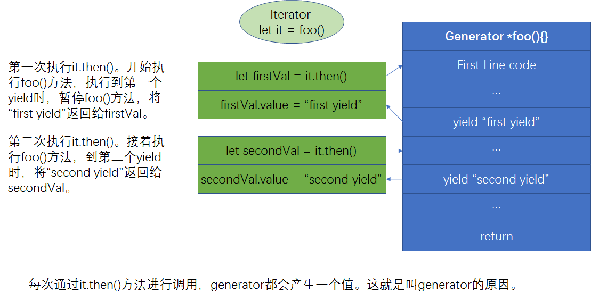

# Generator'ing Values


Generator 产生一系列值。为了取出这些值，常用的解决方案是使用 Iterator。

## Iterator 和 Iterable

### Iterator

```javascript
var something = (function() {
  // something is a Iterable
  let nextVal;
  return {
    [Symbol.iterator]: function() {
      return this;
    },
    next: function() {
      if (nextVal === undefined) {
        nextVal = 1;
      } else {
        nextVal = 3 * nextVal + 6;
      }
      return { done: false, value: nextVal };
    }
  };
})();
/*
  console.log(something.next().value);
  console.log(something.next().value);
  console.log(something.next().value);
  */
for (var ret; (ret = something.next()) && !ret.done; ) {
  console.log(ret.value);

  // don't let the loop run forever!
  if (ret.value > 9) {
    break;
  }
}
for (var v of something) {
  console.log(v);
  if (v > 9) {
    break;
  }
}
```

### Iterables

Iterable is an object that contains an iterator that can iterate over its value。用人话来讲，就是 Iterable 包含 Iterator。要想在**Iterable**获得**Iterator**，只要调用**Iterable**的 Symbol.iterator 方法。

举个例子：

```javascript
var a = [1, 3, 5, 7, 9]; // a是一个Iterable,同时也是一个Iterator

for (var v of a) {
  console.log(v);
}
// 1 3 5 7 9
```

上面的例子等价于:

```javascript
var a = [1, 3, 5, 7, 9];

var it = a[Symbol.iterator](); // get the iterator

it.next().value; // 1
it.next().value; // 3
it.next().value; // 5
```

### Generator Iterator

**当你执行 Generator()，会返回一个 Iterator,同时也是一个 Iterable。**

```javascript
function *foo(){ .. }

var it = foo();
```

上面的 something 可以改写为 generator 形式：

```javascript
function* something() {
  var nextVal;

  while (true) {
    if (nextVal === undefined) {
      nextVal = 1;
    } else {
      nextVal = 3 * nextVal + 6;
    }

    yield nextVal;
  }
}

for (var v of something()) {
  // 注意是something(), 它既是一个Iterator，同时也是一个Iterable
  console.log(v);

  // don't let the loop run forever!
  if (v > 500) {
    break;
  }
}
// 1 9 33 105 321 969
```

### for-of 详解

for-of 需要传入一个 iterable。for-of 循环首先调用集合的[Symbol.iterator]方法，紧接着返回一个新的迭代器对象。迭代器对象可以是任意具有.next()方法的对象；for-of 循环将重复调用这个方法，每次循环调用一次

```javascript
for (variable of iterable) {
  //statements
}
```
