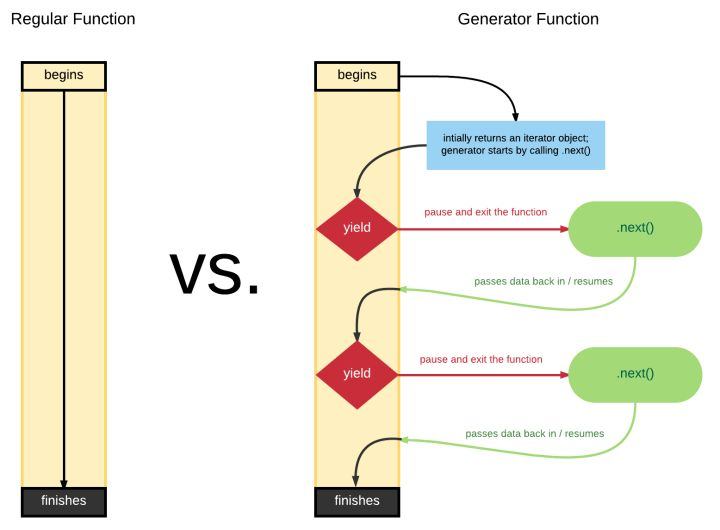

# Generators

## WHY?

前面我们讲，基于回调的异步流程控制有两个问题：

* 反转控制的不可信任（此问题已通过 Promise 解决，请参考本系列前两篇文章）
* 我们的大脑是线性、按照次序去理解流程的，大脑很难理解基于回调的异步流程控制为了解决第二个问题，ES6 引入了 Generators。

## WHAT?

```javascript
var x = 1;
function foo() {
  x++;
  bar(); // <-- what about this line?
  console.log("x:", x);
}
function bar() {
  x++;
}
foo(); // x:3
```

在上面的代码中，bar()在 x++和 console.log( "x:", x )之间执行。

我们考虑一个特殊的情形：如果 bar 是异步的，但是还是要求 bar()在 x++和 console.log( "x:", x )之间执行，但是，我们有什么办法？可以使用 Generators！

```javascript
var x = 1;

function* foo() {
  x++;
  yield; // pause!
  console.log("x:", x);
}

function bar() {
  x++;
}

// construct an iterator `it` to control the generator
var it = foo();

// start `foo()` here!
it.next(); // 执行yield之前的代码
x; // 2
bar();
x; // 3
it.next(); // 执行yield之后的代码 ，x:3
```

## Input and Output

可以给 generator 里传参。

```javascript
function* foo(x, y) {
  return x * y;
}
var it = foo(6, 7); // "it" is a generator object
var res = it.next();
//begin to run code in foo(), and will paused when yield/return, and return an object and assign to res. res = {done:true,value:42}
res.value; // 42
```

## Iteration Messaging 信息传递



```javascript
function* foo(x) {
  var y = x * (yield);
  return y;
}

var it = foo(6);

// start `foo(..)`
var first = it.next();

var res = it.next(7);

res.value; // 42
```

刚开始，定义一个 generator，并将 6 传入，it 是一个 generator 对象。

var first= it.next();开始执行*foo()里的代码，同时，x 在之前已经传入为 6。当执行到 var y = x * (yield);时，碰到 yield，停止执行，在这个时刻，会有两个操作，一是请求唤醒时，唤醒的代码要给 yield 一个值，二是返回一个对象并赋值给 first，first = {done:false, value: undefined}。

var res = it.next( 7 );唤起\*foo()继续执行，此时，在之前停止的地方需要传入一个参数，这个参数通过 next(7)传入，得到 y=42。继续执行，return 42 到 res，res = {done:true, value: 42}。

大家也应该同时注意到了，next()比 yield 总是多一个。原因是第一个 next()是用来开始一个 generator 的，执行到 yield 时暂停,yeild 会抛出一个信息(在这个例子里是 undefined)。之后，需要另一个 next()来唤醒 yield,同时 next 里的参数 fulfill yield 表达式。以此类推，最后一个 next()执行后，generator 是返回一个 return 来结束的。

我们再来看一个例子,这个比较形象。

```javascript
function* foo(x) {
  var y = x * (yield "Hello"); // <-- yield a value!
  return y;
}

var it = foo(6);

var res = it.next(); // first `next()`, don't pass anything
res.value; // "Hello"

res = it.next(7); // pass `7` to waiting `yield`
res.value; // 42
```

在上面的代码中，可以形容为：

**var res = it.next();**

    1.generater开始执行吧。

    2.你会给我什么值？

**yield "hello"**

    1.给你一个 hello。(yield..是对第一个 next()的回应，回应的内容是"hello"。)

    2.你会给我什么值？

**res = it.next( 7 );**

    1.给你一个 7。(next( 7 )是对 yield 的回应，告诉 yield 表达式，你那里应该是个 7。)

    2.你会给我什么值？

**yield "hello"之后的代码,执行到了 return**

    1.给你一个 42。

    2.我活做完了，别问我了，再见。
