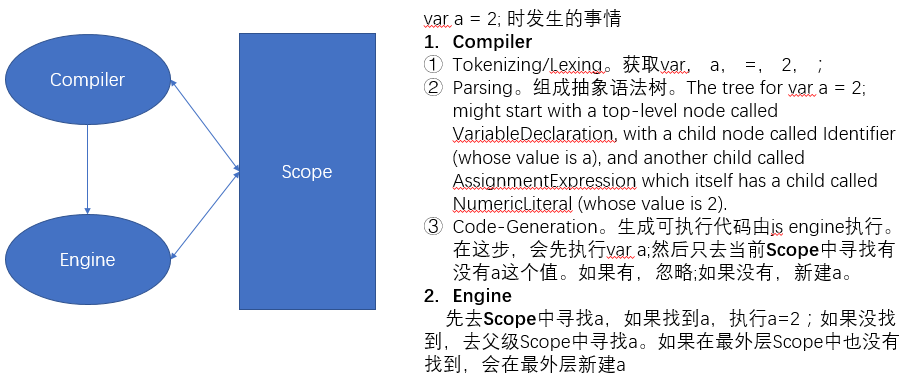

# 作用域

作用域是一套定义存储变量和查找变量的规则。

## 编译和执行时发生的事

当执行 `var a = 2;` 时，发生了什么呢？

Compiler 进行编译，询问 Scope 是否有 a 的值，如果没有，在 Scope 中新建 a。Compiler 编译完后，由 Engine 进行执行。在执行过程中，Engine 询问 Scope 是否有 a 。如果没有，去上一层查找。


Tips: 上图中，Compile 和 Scope 其实都是 Engine 的一部分。Engine 统管 JavaScript 的编译和执行。

### LHS && RHS

在 Engine 询问 Scope 时，会涉及查找问题。分为两种查找方式：
LHS(left-hand side) 寻找变量容器本身，RHS(righte-hand side) 寻找变量容器中的值。如 `var a = 2`，变量容器是 a，2 是其中的值。

不成功的 RHS 引用会导致抛出 ReferenceError 异常。不成功的 LHS 引用会导致自动隐式
地创建一个全局变量（非严格模式下），该变量使用 LHS 引用的目标作为标识符，或者抛
出 ReferenceError 异常（严格模式下）。

比如，在执行 `console.log(a)` 没找到 a，会报 ReferenceError。如果 RHS 找到了，但执行了值不具备的方法或属性，报 TypeError。


## 词法作用域

JavaScript 的作用域类型是 Lexical Scope(词法作用域)，有些语言的 Scope 类型是 Dynamic Scope。顾名思义，词法作用域就是指在 Compiler 执行时，变量所处的范围。一般来说，词法作用域就是指**代码书写时所处的代码块**。

### 词法作用域规则

```javascript
var a = 10086;
function foo(a) {
  console.log(a + b);
  console.log(a);
}
var b = 2;
foo(2);
/*
output:
4
2
*/
```

Engine 在执行 JavaScript 代码时，会优先去当前运行时所处的词法作用域中去查找变量。本例中，存在两个作用域，即全局作用域和 foo 作用域。执行 `console.log( a + b );` 时，优先去 foo 作用域中查找 b，没找到 b，继续去全局作用域查找 b。当找到 b 后，执行下一行代码`console.log(a);` 时，还是会先切换回 foo 作用域去查找。

### 作用域欺骗

有 `eval` 和 `with` 两种方式。但由于这两种是执行时才会确定代码，所以会**有性能问题**。尽量避免使用。

- eval

  `eval(str)` 中的 str 就像在编码时就在那一样，相当于 `var b = 3;` 入侵到 foo 的作用域中。

  ```javascript
  function foo(str, a) {
    eval(str); // cheating!
    console.log(a, b);
  }
  var b = 2;
  foo("var b = 3;", 1); // 1 3
  ```

- with

  `with(obj){ }`相当于在 obj 对象上修改属性值。如果新增了属性，会泄漏到全局，造成全局污染。

  ```javascript
  var obj = {
    a: 1,
    b: 2,
    c: 3
  };

  // more "tedious" to repeat "obj"
  obj.a = 2;
  obj.b = 3;
  obj.c = 4;

  // "easier" short-hand
  with (obj) {
    a = 3;
    b = 4;
    c = 5;
  }
  ```

## 函数作用域和块作用域

作用域是封装的一种。

### 函数作用域

#### 函数声明 declaration

`function foo(){..}` 在全局定义了 foo

```javascript
var a = 2;
//该foo函数名会在global scope上定义
function foo() {
  var a = 3;
  console.log(a); // 3
}
foo();
console.log(a); // 2
```

**注意**：上述代码会在 global 上定义 foo，造成全局污染。可以使用 IIFE，避免函数名的全局污染.

#### 函数表达式 expression

`(function foo(){..})` 或 `(function(){..})` 不会在全局定义 foo

```javascript
var a = 2;
//foo 只在()里能调用，在 global scope 中不存在
(function foo() {
  var a = 3;
  console.log(a); // 3
})(); //IIFE 立即执行函数表达式
console.log(a); // 2
```

```javascript
var foo = function() {
  // ..
};

var x = function bar() {
  // ..
};
```

比较上面两种定义函数的方式：

1. 将匿名函数指定给 foo。
2. 将 bar 函数指定给 x。但是，不能直接在之后调用 bar()，否则会报引用错误。

#### 回调函数

在定义 `回调函数表达式` 时，最好将匿名函数加上函数名称，便于 debug

```javascript
setTimeout(function timeoutHandler() {
  console.log("I waited 1 second!");
}, 1000);
```

#### IIFE

`IIFE = 函数表达式 + ()` 表示立即执行函数表达式

```javascript
(function foo() {
  var a = 3;
  console.log(a); // 3
})(); //IIFE 立即执行函数表达式
```

### 块作用域

JS 没有 Block 的概念，如：

```javascript
for (var i = 0; i < 10; i++) {
  console.log(i);
}
```

i 并不是只在{..}中，它在全局的 Scope 中。为了避免无谓的全局变量定义，可以使用以下方法在块里定义变量：

- **with**
- **try()catch(){..}** 中在 catch 中定义的变量只能在 catch 块{}中访问
- **let** 在{}中用 let 定义的变量，只能在该{}中访问
- **const** 在{}中用 const 定义的变量，只能在该{}中访问

## Hoisting 变量提升

一个 Scope 里所有的声明都会提升到 Scope 中其他代码执行之间。

注意：

1. 只有声明会提升，赋值不提升。进一步来说，对于函数，函数声明会提升，但是，函数表达式不提升。
2. 先提升函数后提升变量。

```javascript
console.log(a);
var a = 2;
```

执行结果是打印 undefined。原因是：变量和函数声明先由 compiler 读取，然后由 engine 执行代码。在这里，先将 `var a = 2` 拆成 `var a;` 和 `a =2;` compiler 先执行 `var a;` 然后执行 `console.log( a );` 之后执行 `a=2;`
