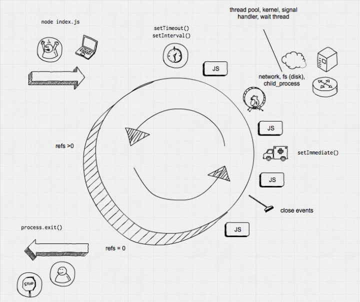
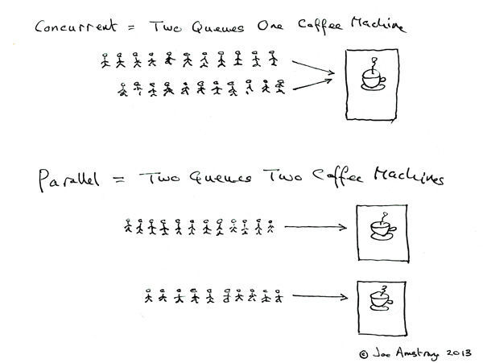

# 异步和性能

## Event Loop 事件循环

### Before ES6

举两个例子：

- JS Engine 在执行 `ajax(url, callback)`时，会告诉`浏览器/node`，挂起 ajax 操作并由浏览器去执行,JS Engine 继续执行接下来的代码。当浏览器完成 ajax 请求，告诉 JS Engine 已经请求完成(即浏览器将 callback 放入 Event Loop 中)。之后，由 JS Engine 决定是否马上执行 callback。
- JS Engine 在执行 `setTimeout(callBack, time)`时，JS Engine 告诉`浏览器/node` 设置一个时间器。当时间器到达，`浏览器/node` 将 callBack 放入 Event Loop 中。

伪代码：

```javascript
// `eventLoop` is an array that acts as a queue (first-in, first-out)
var eventLoop = [];
var event;

// keep going "forever"
while (true) {
  // perform a "tick"
  if (eventLoop.length > 0) {
    // get the next event in the queue
    event = eventLoop.shift();

    // now, execute the next event
    try {
      event();
    } catch (err) {
      reportError(err);
    }
  }
}
```

### ES6

由于 promise 的引进，浏览器的活也集成进 JS Engine。

### 模型图


上图还少一个 Job Queue。Job Queue 里的 job 会在当前 tick 执行完后马上执行，相当于银行排队（Event Loop），来了一个人 B，强行插队在第一个人 A 的后面。A 办完业务后，银行马上办理 B 的业务。

### Concurrency(并行) vs Parallelism(并发)

- concurrency 并行: 在某个时间段中同时有多个任务进行。

- parallel 并发 ： 同时发生多个子任务。用于多核或多线程。

两者的联系及区别见 [Concurrency vs. Parallelism](http://tutorials.jenkov.com/java-concurrency/concurrency-vs-parallelism.html)


## callback 回调

callBack 是面对异步时常见的处理方法。但是会遇到的问题是回调地狱。

- 将 callback 单独拿出来的困境：开发者需要来回在代码里跳跃寻找下一个执行的 callback
- 将 callback 不单独拿出来的困境：不利于 reuse
- 信任问题

### 信任问题

常见的 callback 形式是控制反转 。下面代码中 C 交由 ajax 这个第三方工具执行。但是，交由第三方工具执行时，由于第三方工具不是自己能够控制行为的，会有如下 5 个问题:

```javascript
// A
ajax( "..", function(..){
  // C
} );
// B
```

1. 太早执行回调
2. 太迟执行回调
3. 回调执行次数少了或多了
4. 回调传入的参数不对
5. 将错误隐藏

### 解决信任问题方法

- 分离 callback

```javascript
// ajax捕捉错误方式
function success(data) {
  console.log(data);
}
function failure(err) {
  console.error(err);
}
ajax("http://some.url.1", success, failure);

// Node捕捉错误方式
function response(err, data) {
  // error?
  if (err) {
    console.error(err);
  } else {
    // otherwise, assume success
    console.log(data);
  }
}
ajax("http://some.url.1", response);
```

- 使用 `Promises`
