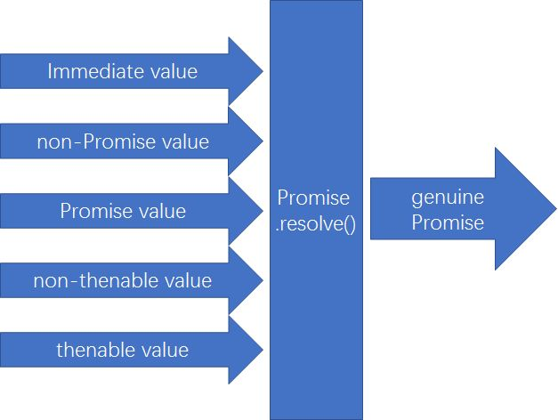
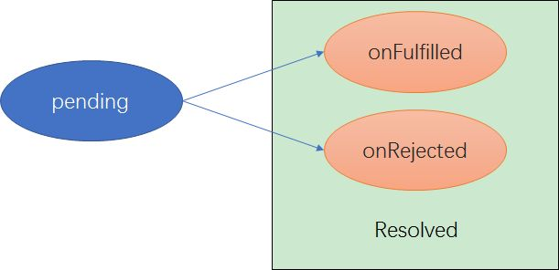
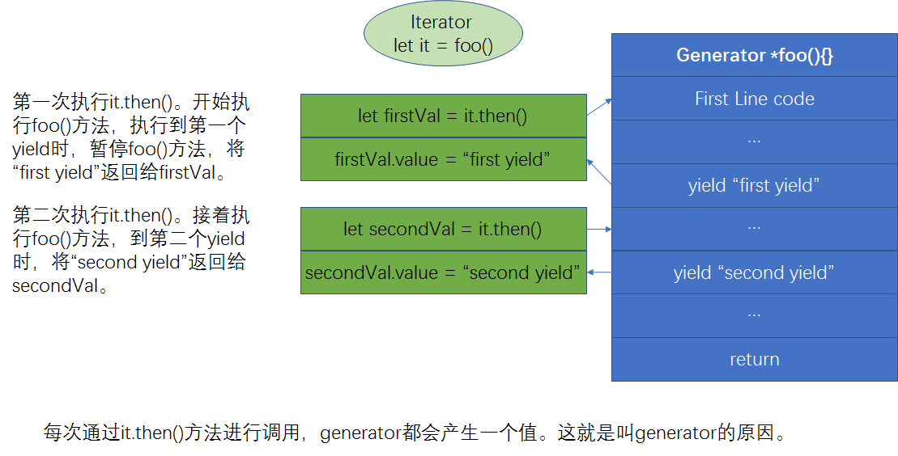
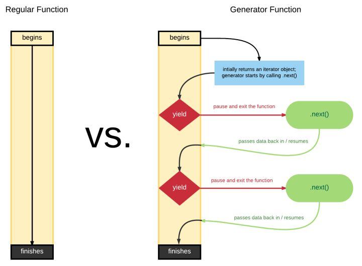

# 异步和性能

## Event Loop 事件循环

### Before ES6

JS Engine 本身没有时间概念，只是按需执行 JavaScript 代码，事件调度由宿主环境`浏览器/node`进行。

举两个例子：

- JS Engine 在执行 `ajax(url, callback)`时，会告诉`浏览器/node`，挂起 ajax 操作并由浏览器去执行,JS Engine 继续执行接下来的代码。当浏览器完成 ajax 请求，告诉 JS Engine 已经请求完成(即浏览器将 callback 放入 Event Loop 中)。之后，由 JS Engine 决定是否马上执行 callback。
- JS Engine 在执行 `setTimeout(callBack, time)`时，JS Engine 告诉`浏览器/node` 设置一个时间器。当时间器到达，`浏览器/node` 将 callBack 放入 Event Loop 中。

伪代码：

```javascript
// `eventLoop` is an array that acts as a queue (first-in, first-out)
var eventLoop = [];
var event;

// keep going "forever"
while (true) {
  // perform a "tick"
  if (eventLoop.length > 0) {
    // get the next event in the queue
    event = eventLoop.shift();

    // now, execute the next event
    try {
      event();
    } catch (err) {
      reportError(err);
    }
  }
}
```

### ES6

由于 promise 的引进，浏览器的活也集成进 JS Engine。

### 模型图


上图还少一个 Job Queue。Job Queue 里的 job 会在当前 tick 执行完后马上执行，相当于银行排队（Event Loop），来了一个人 B，强行插队在第一个人 A 的后面。A 办完业务后，银行马上办理 B 的业务。

### Concurrency(并行) vs Parallelism(并发)

- concurrency 并行: 在某个时间段中同时有多个任务进行。

- parallel 并发 ： 同时发生多个子任务。用于多核或多线程。

两者的联系及区别见 [Concurrency vs. Parallelism](http://tutorials.jenkov.com/java-concurrency/concurrency-vs-parallelism.html)


## callback 回调

callBack 是面对异步时常见的处理方法。但是会遇到的问题是回调地狱。

- 将 callback 单独拿出来的困境：开发者需要来回在代码里跳跃寻找下一个执行的 callback
- 将 callback 不单独拿出来的困境：不利于 reuse
- 信任问题

### 信任问题

常见的 callback 形式是控制反转 。下面代码中 C 交由 ajax 这个第三方工具执行。但是，交由第三方工具执行时，由于第三方工具不是自己能够控制行为的，会有如下 5 个问题:

```javascript
// A
ajax( "..", function(..){
  // C
} );
// B
```

1. 太早/太迟执行回调
2. 回调执行次数少了/多了
3. 回调传入的参数不匹配
4. 将错误隐藏

### 解决信任问题方法

- 分离 callback

```javascript
// ajax 风格
function success(data) {
  console.log(data);
}
function failure(err) {
  console.error(err);
}
ajax("http://some.url.1", success, failure);

// Node 风格
function response(err, data) {
  // error?
  if (err) {
    console.error(err);
  } else {
    // otherwise, assume success
    console.log(data);
  }
}
ajax("http://some.url.1", response);
```

- 使用 `Promises`

## Promise

Promise 代表未来的值或事件的完成。Promise 状态确定后（onFulfilled 或 onRejected）就不会改变。

Promise 在规范上规定 Promise 只能使用**异步调用**方式 。不管是同步还是异步，回调都使用异步。即使 promise 是立即 fulfilled 或 rejected，then 里的 callback 也是异步执行的,会先去执行 `console.log("first")`方法。这种方法与`setTimeout(..,0)`类似，表示将 then 里的 callback 放入 job queue。

```javascript
let fetchResponse = new Promise(function(resolve, reject) {
  //在这种情况下，传入的函数会立即执行。
  return resolve({ name: "frank" }); // fetchResponse 马上resolved。
}).then(res => {
  console.log("second"); // then里的callback异步执行，先放入event loop的job queue
});
console.log("first");
setTimeout(() => {
  console.log("third");
}, 0);
// 输出： 先first然后second,最后third
```

再来看这个例子：

```javascript
var p3 = new Promise(function(resolve, reject) {
  resolve("B");
}); //1. p3 resolved

var p1 = new Promise(function(resolve, reject) {
  resolve(p3); //2. p1 pending
  //7. p1 resolved
});

var p2 = new Promise(function(resolve, reject) {
  resolve("A"); //3. p2 resolved
});

p1.then(function(v) {
  //4. run p1.then, will not call callback
  console.log(v); //8. p1 resolved, call callback
});

p2.then(function(v) {
  //5. run p2.then, will not call callback
  console.log(v); //6. p2 resolved, call callback
});
```

最后一个例子,`then(callback1,callback2)`相当于是对 Promise 的监听，Promise 完成后，执行回调 callback1 或 callback2。

```javascript
p.then(function() {
  // 第一个p.then
  p.then(function() {
    // 第三个p.then
    console.log("C");
  });
  console.log("A");
});
p.then(function() {
  // 第二个p.then
  console.log("B");
});
// 执行次序：
// 1. 第一个p.then,不执行其中的回调
// 2. 第二个p.then,不执行其中的回调
// 3. 执行第一个p.then中的回调：
//    3a. 执行第三个p.then,不执行其中的回调
//    3b. 打印A
// 4. 执行第二个p.then中的回调，打印B
// 5. 执行第三个p.then中的回调，打印C
```

### 建立 promise 方法

- 注意事项

  下面的 p 是立即完成的 Promise，但是对一个 Promise 调用`then()`时，即使这个 Promise 已经完成，`then()`中的回调也是**异步**的。

  ```javascript
  var p = new Promise(function(resolve) {
    resolve(42);
  });
  p.then(v => {
    console.log(v);
  });
  console.log("hello");
  // 输出次序为： hello --> 42。
  ```

- 通过构造器。传入的函数立即执行。

  ```javascript
  var promise = new Promise(function(resolve, reject) {
    // 异步处理
    // 处理结束后,调用resolve 或 reject
  });
  promise.then(onFulfilled, onRejected); //第一种处理reject的方法
  promise.catch(onRejected); // 第二种处理reject的方法
  ```

- 通过`.then()`返回新的 promise

  ```javascript
  // a.自己封装
  Promise.resolve(42).then(function(value) {
    console.log(value);
    return new Promise();
  });

  // b.通过默认封装。
  //在then中通过return返回的数据，引擎会将该数据进行Promise.resolve()包装，
  //返回一个新的Promise对象
  Promise.resolve(42).then(function(value) {
    console.log(value);
    return "hi";
  });
  ```

### Thenable Duck Typing

在实际应用场景中，有些 promise 并不是浏览器原生的，而是由某些第三方插件引入的。所以，用`p instanceof Promise` 来确定是不是 Promise 往往是不合适的。我们把这种类似 promise 的对象叫做 Thenable 对象，这些对象都有一个 then()方法。

注意，不是所有有`then()`方法的对象都是 Thenable 对象。通常，人们使用 Duck Typing 方法来确认是不是 Thenable 对象。Duck Typing 方法是指识别一样东西是不是鸭子，只要它看起来像鸭子，并且叫起来像鸭子，那就是鸭子了。但是，这个方法不是总是奏效的。（暂时没找到能识别是不是 Thenable 对象的方法）。

### 为什么 Promise 是可信任的？

当你无法确认某个方法返回的对象是不是真实的 Promise 对象，可以使用 `Promise.resolve(p)`生成一个新的真实的 promise 对象。



```javascript
// 不要只是这么做
foo(42) // foo(42)可能返回的并不是Promise
  .then(v => {
    console.log(v);
  });

// 要这么做
Promise.resolved(foo(42)).then(v => {
  console.log(v);
});
```

### Promise Chain

#### promise 的状态变化



#### 规范

```javascript
var rejectedPr = new Promise(function(resolve, reject) {
  // resolve this promise with a rejected promise
  resolve(Promise.reject("Oops")); //resolve()可能返回fulfilled或rejected
});

rejectedPr.then(
  function fulfilled() {
    // never gets here
  },
  function rejected(err) {
    console.log(err); // "Oops"
  }
);
```

#### 详细执行过程

```javascript
// 具体执行过程请使用chrome调试查看 fetch是一种Promise
debugger;
let fetchResponse = fetch("https://api.github.com"); // Step 1 发起api请求
let jsonRes = fetchResponse.then(
  // Step 2 执行fetchResponse.then()，但不执行其中的回调。
  res => res.json() // Step 4 fetchResponse完成，执行回调。
);
//显式return res.json()，
//jsonRes 成为一个fulfilled的promise，其中的值为res.json()
let result = jsonRes.then(res => {
  // Step 3 执行jsonRes.then()，但不执行其中的回调。
  console.log(res); // Step 5 jsonRes完成，执行回调。
});
//如果没有显式return，默认return undefined。
//之后，result成为一个fulfilled的promise，其中的值为undefined。
```

具体参见 [Promise.prototype.then()](https://developer.mozilla.org/en-US/docs/Web/JavaScript/Reference/Global_Objects/Promise/then)

再举一个例子：

```javascript
// step 1:
request("http://some.url.1/")
  // step 2:
  .then(function(response1) {
    foo.bar(); // undefined, error! 产生error,Step2返回rejected状态的promise

    // never gets here
    return request("http://some.url.2/?v=" + response1);
  })
  // step 3:
  .then(
    function fulfilled(response2) {
      // never gets here
    },
    // rejection handler to catch the error
    function rejected(err) {
      // step2产生的error在这里被handle
      console.log(err); // `TypeError` from `foo.bar()` error
      return 42; // Step3返回fulfill状态的promise，因此可以继续执行Step4
    }
  )
  // step 4:
  .then(function(msg) {
    console.log(msg); // 42
  });
```

#### 常见写法

```javascript
debugger;
let p1 = new Promise(function(resolve, reject) {
  foo.bar();
  return resolve({ name: "frank" });
});
p2 = p1.then(
  onfilled => {
    return 0;
  },
  onrejected => {
    return 1;
  }
);
//执行完后，P1是rejected，P2是resolved。P2为resloved的原因是P1被onrejected函数捕获，返回了一个resloved的promise
```

##### 省略`onRejected`

```javascript
debugger;
let p1 = new Promise(function(resolve, reject) {
  foo.bar();
  return resolve({ name: "frank" });
});
p2 = p1.then(
  onfilled => {
    return 0;
  }
  // assumed rejection handler, if omitted or
  // any other non-function value passed
  // function(err) {
  //     throw err;
  // }
);
//执行完后，P1和P2都是rejected。P2为rejected的原因是默认的rejection handler会抛出捕获到的P1的rejected promise。同时，如果P2的rejected promise没有被其他捕获，会使系统报错
```

##### 省略`onFilled`，等价于`catch()`

```javascript
debugger;
let p1 = new Promise(function(resolve, reject) {
  return resolve({ name: "frank" });
});
p2 = p1.then(
  // function(v) {
  //     return v;
  // }
  null,
  onrejected => {
    return 1;
  }
);
//执行完后，P1和P2都是resolved。从代码可知，P1和P2里的值是一样的{name: "frank"}。
//then(null,function(err){ .. })等价于catch(function(err){ .. })
```

#### error handler

##### 为什么需要 error handler

```javascript
var p = new Promise( function(resolve,reject){
  foo.bar(); // `foo` is not defined, so error!
  resolve( 42 ); // never gets here :(
} );
// 如上代码，在执行foo.bar()时，p的状态由pending转为rejected。
//同时，如果rejected状态的promise没有handler去handle，会报错。
VM1095:2 Uncaught (in promise) ReferenceError: foo is not defined
    at <anonymous>:2:2
    at new Promise (<anonymous>)
    at <anonymous>:1:9
```

##### 捕捉无穷尽的 error

```javascript
var p = Promise.resolve(42); // Step1

p.then(
  // Step2
  function fulfilled(msg) {
    // numbers don't have string functions,
    // so will throw an error
    console.log(msg.toLowerCase());
  }
).catch(handleErrors);
//使用catch能解决step1和Step2产生的error，但是如果handleErrors 自身会产生error呢？暂时在ES6中没能解决这个问题。一些第三方Lib使用了done()来捕捉handleErrors产生的error。
```

### Promise 模式

#### `Promise.all([ .. ])`

每个 promise 都 fulfilled 后执行 then.如果 p1 或 p2 有一个 rejected 了，Promise.all( [p1,p2] )就返回一个 rejected 的 promise.

```javascript
var p1 = request("http://some.url.1/");
var p2 = request("http://some.url.2/");

Promise.all([p1, p2])
  .then(function(msgs) {
    // msgs是一个数组
    // both `p1` and `p2` fulfill and pass in
    // their messages here
    return request("http://some.url.3/?v=" + msgs.join(","));
  })
  .then(function(msg) {
    console.log(msg);
  })
  .catch(errorHandler);
```

#### `Promise.race([ .. ])`

P1 和 P2 竞争，谁先 `resolved(fulfilled 或 rejected)`,`Promise.race([ P1,P2 ])`就是谁的状态.

不要在参数数组中传入空数组，由于设计上的缺陷，`Promise.race([ ])`会导致这个 Promise 永远无法 resolve.

```javascript
// `request(..)` is a Promise-aware Ajax utility,
// like we defined earlier in the chapter

var p1 = request("http://some.url.1/");
var p2 = request("http://some.url.2/");

Promise.race([p1, p2])
  .then(function(msg) {
    // either `p1` or `p2` will win the race
    return request("http://some.url.3/?v=" + msg);
  })
  .then(function(msg) {
    console.log(msg);
  })
  .catch(errorHandler);
```

#### 常用 API 举例

```javascript
var p1 = Promise.resolve(42);
var p2 = Promise.resolve("Hello World");
var p3 = Promise.reject("Oops");

Promise.race([p1, p2, p3]).then(function(msg) {
  console.log(msg); // 42
});

Promise.all([p1, p2, p3]).catch(function(err) {
  console.error(err); // "Oops" p3是拒绝的，所以抛出Reject
});

Promise.all([p1, p2]).then(function(msgs) {
  console.log(msgs); // [42,"Hello World"]
});
```

## Generator

### 为什么引入 Generator

前面我们讲，基于回调的异步流程控制有两个问题：

- 反转控制的不可信任（此问题已通过 Promise 解决，请参考本系列前两篇文章）
- 我们的大脑是线性、按照次序去理解流程的，大脑很难理解基于回调的异步流程控制。为了解决第二个问题，ES6 引入了 Generator。

### 什么是 Generator

```javascript
var x = 1;
function foo() {
  x++;
  bar();
  console.log("x:", x);
}
function bar() {
  x++;
}
foo(); // x:3
```

在上面的代码中，`bar()`在 `x++`和`console.log( "x:", x )`之间执行。

我们考虑一个特殊的情形：如果 bar 是异步的，但是还是要求 `bar()`在 `x++`和 `console.log( "x:", x )`之间执行，但是，我们有什么办法？可以使用 Generators！

```javascript
var x = 1;

// 定义Generator
function* foo() {
  x++;
  yield; // pause!
  console.log("x:", x);
}

function bar() {
  x++;
}

// 构造Generator
var it = foo();

// 执行Generator
it.next(); // 执行yield之前的代码

x; // 2
bar();
x; // 3

// 执行Generator
it.next(); // 执行yield之后的代码 ，x:3
```


Generator 产生一系列值。为了取出这些值，常用的解决方案是使用 Iterator。

### Iterator 和 Iterable

#### Iterator

Iterator 是一个具有`next()`方法的对象，它存在的目的是为了改善遍历的体验。`next()`返回一个包含`value`和`done`属性的对象。

```javascript
function makeIterator(array) {
  var nextIndex = 0;

  return {
    next: function() {
      return nextIndex < array.length
        ? {
            value: array[nextIndex++],
            done: false
          }
        : {
            value: undefined,
            done: true
          };
    }
  };
}
var it = makeIterator(["a", "b"]); // it是一个Iterator
it.next().value; // 'a'
it.next().value; // 'b'
```

#### Iterables

Iterable 是一个具有 Symbol.iterator 属性的对象。这个属性是一个函数，返回一个 Iterator。 在 ES6 中，所有的集合类对象(Arrays, Sets, and Maps) 和 strings 都是 iterable。

Iterable 的存在是为了配合使用 ES6 的新遍历方式——`for...of`。

它的**执行原理**是这样的：在使用`for...of`遍历 `Iterable` 时，

1. 会调用 Iterable 内置的`Symbol.iterator`方法，产生一个 iterator
2. 在每一轮遍历中，调用 iterator 的 next 方法，得到具体的值。这个遍历过程直到 next 返回的对象的`done`为 true。

```javascript
// something is an Iterable, and also an Iterator
var something = (function() {
  let nextVal;
  return {
    [Symbol.iterator]: function() {
      return this;
    },
    next: function() {
      if (nextVal === undefined) {
        nextVal = 1;
      } else {
        nextVal = 3 * nextVal + 6;
      }
      return { done: false, value: nextVal };
    }
  };
})();
// 1. 自己使用循环
for (var ret; (ret = something.next()) && !ret.done; ) {
  console.log(ret.value);
  // don't let the loop run forever!
  if (ret.value > 9) {
    break;
  }
}
// 2. 使用for...of迭代Iterable
for (var v of something) {
  console.log(v);
  if (v > 9) {
    break;
  }
}
```

再举个例子：

```javascript
var a = [1, 3, 5, 7, 9]; // a是一个Iterable,同时也是一个Iterator

for (var v of a) {
  console.log(v);
}
// 1 3 5 7 9
```

上面的例子等价于:

```javascript
var a = [1, 3, 5, 7, 9];

var it = a[Symbol.iterator](); // get the iterator

it.next().value; // 1
it.next().value; // 3
it.next().value; // 5
```

##### Generator Iterator

当你执行 Generator()，会返回一个 Iterator,同时也是一个 Iterable。

```javascript
function *foo(){ .. }

var it = foo();
```

上面的 something 可以改写为 generator 形式：

```javascript
function* something() {
  var nextVal;

  while (true) {
    if (nextVal === undefined) {
      nextVal = 1;
    } else {
      nextVal = 3 * nextVal + 6;
    }

    yield nextVal;
  }
}

for (var v of something()) {
  // 注意是something(), 它既是一个Iterator，同时也是一个Iterable
  console.log(v);

  // don't let the loop run forever!
  if (v > 500) {
    break;
  }
}
// 1 9 33 105 321 969
```

### 输入和输出

可以给 generator 里传参。

```javascript
function* foo(x, y) {
  return x * y;
}
var it = foo(6, 7); // 构建Generator
var res = it.next();
//执行Generator里的函数。遇到yield/return返回。res = {done:true,value:42}
res.value; // 42
```

### Iteration Messaging 信息传递



```javascript
function* foo(x) {
  var y = x * (yield);
  return y;
}

var it = foo(6);

// start `foo(..)`
var first = it.next();

var res = it.next(7);

res.value; // 42
```

刚开始，定义一个 generator，并将 6 传入，it 是一个 generator 对象。

`var first= it.next();`开始执行`*foo()`里的代码，同时，x 在之前已经传入为 6。当执行到 `var y = x \* (yield);`时，碰到`yield`，停止执行，在这个时刻，会有两个操作，

- 请求唤醒时，唤醒的代码要给 yield 一个值
- 返回一个对象并赋值给 first，`first = {done:false, value: undefined}`。

`var res = it.next( 7 );`唤起`*foo()`继续执行，此时，在之前停止的地方需要传入一个参数，这个参数通过 next(7)传入，得到 y=42。继续执行，return 42 到 res，res = {done:true, value: 42}。

大家也应该同时注意到了，`next()`比 yield 总是多一个。原因是第一个 `next()`是用来开始一个 generator 的，执行到 yield 时暂停,yeild 会抛出一个信息(在这个例子里是 undefined)。之后，需要另一个 `next()`来唤醒 yield,同时 next 里的参数代替 yield 表达式。以此类推，最后一个 `next()`执行后，generator 是返回一个 return 来结束的。

#### 形象例子

```javascript
function* foo(x) {
  var y = x * (yield "Hello"); // <-- yield a value!
  return y;
}

var it = foo(6);

var res = it.next(); // first `next()`, don't pass anything
res.value; // "Hello"

res = it.next(7); // pass `7` to waiting `yield`
res.value; // 42
```

在上面的代码中，可以形容为：

主程序执行到`var res = it.next();`

```markdown
1.generater 开始执行吧。

2.你会给我什么值？
```

Generator 执行到`yield "hello"`

```markdown
1.给你一个 hello。(yield..是对第一个 next()的回应，回应的内容是"hello"。)

2.你会给我什么值？
```

主程序执行到`res = it.next( 7 );`

```markdown
1.给你一个 7。(next( 7 )是对 yield 的回应，告诉 yield 表达式，你那里应该是个 7。)

2.你会给我什么值？
```

Generator 执行到`yield "hello"之后的代码,执行到了 return`

```markdown
1.给你一个 42。

2.我活做完了，别问我了，再见。
```
